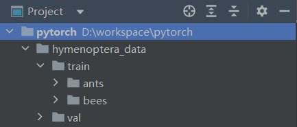
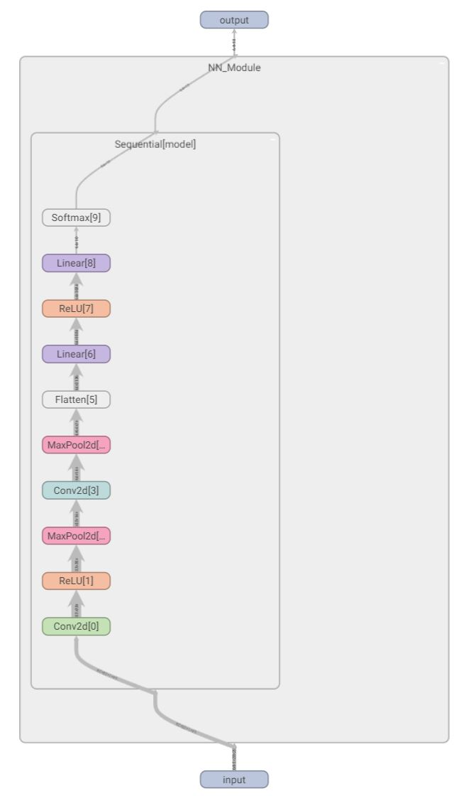

PyTorch和TensorFlow是当今最知名的两大深度学习框架，近两年PyTorch在学术领域迅速反超TensorFlow并成为主流，是目前最有前景的深度学习框架。

笔记介绍了PyTorch的基本函数和搭建框架以及训练优化的常规思路，共包含六个部分，分别是数据准备、模型搭建、模型训练、模型验证、模型保存与读取、常规搭建与训练思路。

参考资料：[官方文档（PyTorch documentation）](https://pytorch.org/docs/stable/index.html)

---

# 一、数据准备

## 1. 读取数据

读取数据需要创建一个`torch.utils.data.Dataset`类的实例。PyTorch提供了一些Dataset子类便于直接读取公开的数据集资源，本地训练样本一般构建一个自定义的子类进行读取。

**读取公开数据集：**

以图像数据为例，`torchvision.datasets`中定义了许多公开图像数据集资源的Dataset子类。以读取CIFAR-10数据集为例，使用`torchvision.datasets.CIFAR10()`可以实例化数据，其中：

- root：根目录地址

- train：获取训练集还是测试集，True为训练集，False为测试集

- download：是否下载，设置为True时当数据集已存在时会自动跳过

- transform：调用预处理程序，None为不处理

参考代码：

```python
from torchvision.datasets import CIFAR10

root_dir = "./dataset"
test_data = CIFAR10(root = root_dir,
                    train = False,
                    download = True,
                    transform = torchvision.transforms.ToTensor())
```

**读取本地数据集：**

本地数据因存储图片与标签的方式不同，一般需要自定义类来正确读取数据。

要点是在`__init__(self)`函数中定义类内的全局变量；在`__getitem__(self, item)`函数中定义读取索引图片和标签内容的函数，并返回图片与标签的内容；通常还定义`__len__(self)`函数返回数据集的长度。

以下是其中一种存储结构及其读取代码：



```python
from torch.utils.data import Dataset
from PIL import Image
import os

class Mydata(Dataset):
    def __init__(self, root_dir, label_dir):
        self.root_dir = root_dir
        self.label_dir = label_dir
        self.path = os.path.join(self.root_dir,
                                 self.label_dir)
        self.img_path = os.listdir(self.path)

    def __getitem__(self, item):
        img_name = self.img_path[item]
        img_item_path = os.path.join(self.root_dir,
                                     self.label_dir,
                                     img_name)
        img = Image.open(img_item_path)
        label = self.label_dir
        return img, label

    def __len__(self):
        return len(self.img_path)

root_dir = "hymenoptera_data/train"
ants_label_dir = "ants"
bees_label_dir = "bees"
ants_dataset = Mydata(root_dir, ants_label_dir)
bees_dataset = Mydata(root_dir, bees_label_dir)
train_dataset = ants_dataset + bees_dataset
```

## 2. 变换

变换是对数据进行常见的预处理，如重采样、格式转换、裁剪等。PyTorch对图形、文本和声音的变换工具分别位于 `torchvision.transforms`，`torchtext.transforms`和`torchaudio.transforms`。

变换类的实例可以直接作为函数使用：

```python
from PIL import Image
from torchvision import transforms

a = Image.open("test.jpg")

transform = transforms.ToTensor()
a.ts = transform(a)
```

通常作为参数在读取数据时使用：

```python
from torchvision import transforms
from torchvision.datasets import CIFAR10

root_dir = "./dataset"
transform = transforms.ToTensor()
test_data = CIFAR10(root = root_dir,
                    train = False,
                    download = True,
                    transform = transform)
```

当变化较多时可使用`transforms.Compose()`函数进行组合定义：

```python
from torchvision import transforms

transform = transforms.Compose([transforms.Resize(400),
                                transforms.CenterCrop(400),
                                transforms.ToTensor()])
```

## 3. 加载数据集

加载数据集`torch.utils.data.DataLoader()`是从数据集中选取和组织数据，常用的参数如下：

- dataset：数据源

- batch_size：每个批次的样本数量

- shuffle：数据集是否随机洗牌

- drop_last：若数据集总量不能完全分配到每个批次，是否剔除最后一个批次

参考代码：

```python
from torch.utils.data import DataLoader

test_loader = DataLoader(dataset = train_data,
                         batch_size = 64,
                         shuffle = True,
                         drop_last = True)
```

定义后用循环将数据中的批次依次送入网络计算和训练：

```python
for epoch in range(20):
    for data in test_loader:
        imgs, targets = data
```

# 二、模型搭建

神经网络的框架由不同的层构成，`torch.nn`类中定义了卷积层、池化层、线性层等众多预设的层，不同类型层的参数与定义可参考[torch.nn - PyTorch 1.13 documentation](https://pytorch.org/docs/stable/nn.html)。

*注：`torch.nn`下的类用于模型构建，`torch.nn.functional`下的对应函数可直接使用。*

```python
from torch import nn

conv1 = nn.Conv2d(3, 32, 5, 1, 2)
conv2 = nn.Conv2d(32, 32, 5, 1, 2)
maxpool = nn.MaxPool2d(2)
```

当层数较多时可用`torch.nn.Sequantial()`类组合定义模型：

```python
from torch import nn

model = nn.Sequential(
    nn.Conv2d(3, 32, 5, 1, 2),
    nn.MaxPool2d(2),
    nn.Conv2d(32, 32, 5, 1, 2),
    nn.MaxPool2d(2),
    nn.Conv2d(32, 64, 5, 1, 2),
    nn.MaxPool2d(2),
    nn.Flatten(),
    nn.Linear(64*4*4, 64),
    nn.Linear(64, 10)
)
```

构建完整的神经网络框架需要定义一个`torch.nn.Module`的子类。在`__init__(self)`函数中初始化模型，并定义模型需要使用的各类神经层；在`forward(self, x)`函数中使用定义好的层组建神经网络，最终返回输出值。

```python
from torch import nn

class NN_Module(nn.Module):
    def __init__(self):
        super(NN_Module, self).__init__()
        self.model = nn.Sequential(
            nn.Conv2d(3, 32, 5, 1, 2),
            nn.MaxPool2d(2),
            nn.Conv2d(32, 32, 5, 1, 2),
            nn.MaxPool2d(2),
            nn.Conv2d(32, 64, 5, 1, 2),
            nn.MaxPool2d(2),
            nn.Flatten(),
            nn.Linear(64*4*4, 64),
            nn.Linear(64, 10)
        )
    def forward(self, x):
        x = self.model(x)
        return x

nn_module = NN_Module()
```

# 三、模型训练

模型训练即优化模型中的参数（权重），为此需要确定误差的定义（损失函数）与优化的方法（优化器）。进入训练前使用模型实例的`.train()`函数进入训练模式。

```python
nn_module.train()
```

## 1. 损失函数

损失函数是模型反向传播误差优化权重的依据，实例化合适的损失函数后，计算误差，再使用误差的`backward()`函数反向传播。不同的损失函数可参考[torch.nn - PyTorch 1.13 documentation](https://pytorch.org/docs/stable/nn.html#loss-functions)。

```python
from torch import nn

# 定义损失函数
loss_fn = nn.CrossEntropyLoss()

# 计算误差，outputs是模型输出，targets是正确标签
loss = loss_fn(outputs, targets) 

# 反向传播误差
loss.backward()
```

## 2. 优化器

优化器定义了模型权重的优化方式，`torch.optim`类提供了多种优化器。不同优化器的参数和方法介绍可参考[torch.optim - PyTorch 1.13 documentation](https://pytorch.org/docs/stable/optim.html)。一般需要设置学习速率（lr）。

```python
import torch

# 定义优化器
optimizer = torch.optim.SGD(params = nn_module.parameters(),
                            lr = learning_rate)

# 在反向传播误差计算梯度后进行权重优化
optimizer.step()
```

# 四、模型验证

模型的验证可以继续使用损失函数，也可以自定义新的规则，只需要循环验证集数据的批次作为模型输入对比输出与标签即可。进入验证前使用模型实例的`.train()`函数进入验证模式。

```python
nn_module.eval()
```

使用`with torch.no_grad()`可以停止梯度运算提高效率。

```python
total_test_loss = 0
with torch.no_grad():
    for data in test_dataloader:
        imgs, targets = data
        outputs = nn_module(imgs)
        loss = loss_fn(outputs, targets)
        total_test_loss = total_test_loss + loss.item()
```

# 五、模型保存与读取

## 1. 模型保存

训练完毕的模型有两种保存方式。

```python
import torch

# 保存模型结构与参数
torch.save(obj = nn_module,
           f = "NN_Module.pth")

# 仅保存模型参数
torch.save(obj = nn_module.state_dict(),
           f = "NN_Module_state_dict.pth")
```

## 2. 模型读取

加载之前保存的训练模型或参数使用`torch.load()`函数。

```python
import torch

# 读取模型结构与参数
torch.load("NN_Module.pth")

# 仅读取模型参数 
model.load_state_dict(torch.load("NN_Module_state_dict.pth"))
```

## 3. 现有模型

PyTorch在`torchvision.models`提供了一些经典的训练完毕的模型，以vgg16为例，设置值pretrained参数选择是否读取训练完毕的权重。

```python
import torch

vgg16 = torchvision.models.vgg16(pretrained = True)
```

还可以对这些模型进行修改：

```python
# 在vgg16模型最后添加一个线性层
vgg16.add_module('linear', nn.Linear(1000, 10))

# 在vgg16模型的classifier部分后添加一个线性层
vgg16.classifier.add_module('add_linear', nn.Linear(1000, 10))

# 将vgg16模型的classifier部分中第7个层改为线性层
vgg16.classifier[6] = nn.Linear(4096, 10)
```

# 六、常规搭建与训练思路

## 1. 常规思路

1. 定义与加载数据集

2. 创建网络模型和定义损失函数与优化器

3. 循环训练次数与批次训练模型
   
   1. 输出单个批次的模型输出
   
   2. 计算和反向传播该批次的误差
   
   3. 模型权重优化

参考代码：

```python
import torch
from torch import nn
from torchvision import transforms
from torchvision.datasets import MNIST
from torch.utils.data import DataLoader


# 定义模型
class NN_Module(nn.Module):
    def __init__(self):
        super(NN_Module, self).__init__()
        self.model = nn.Sequential(
            nn.Conv2d(1, 32, 5, 1, 2),
            nn.ReLU(),
            nn.MaxPool2d(2),
            nn.Conv2d(32, 64, 5, 1, 2),
            nn.MaxPool2d(2),
            nn.Flatten(),
            nn.Linear(7 * 7 * 64, 1024),
            nn.ReLU(),
            nn.Linear(1024, 10),
            nn.Softmax(dim=1)
        )

    def forward(self, x):
        x = self.model(x)
        return x


# 定义训练程序
def train_model(module,
                epoch,
                train_dataloader,
                loss_fn,
                optimizer):
    module.train()

    # 记录训练的次数
    total_train_step = 0

    for i in range(epoch):
        for data in train_dataloader:
            imgs, targets = data
            imgs = imgs.to(device)
            targets = targets.to(device)
            outputs = module(imgs)

            # 误差计算和权重优化
            loss = loss_fn(outputs, targets)
            optimizer.zero_grad()
            loss.backward()
            optimizer.step()

            # 统计
            total_train_step = total_train_step + 1
            if total_train_step % 100 == 0:
                print("epoch: {}, batch：{}, Loss: {:.3f}".format(i + 1,
                                                             total_train_step,
                                                             loss.item()))


# 定义验证程序
def val_model(modol,
              val_dataloader):
    modol.eval()
    total_hits = 0
    with torch.no_grad():
        for data in val_dataloader:
            imgs, targets = data
            imgs = imgs.to(device)
            targets = targets.to(device)
            outputs = modol(imgs)
            hits = (outputs.argmax(1) == targets).sum()
            total_hits = total_hits + hits
    total_accuracy = total_hits / len(val_dataset)
    print("Accuracy: {:.2f}".format((total_accuracy.round(decimals=2))))


# 定义transform
transform = transforms.Compose([transforms.ToTensor()])

# 读取数据集
train_dataset = MNIST(root="Data",
                      train=True,
                      download=True,
                      transform=transform)
val_dataset = MNIST(root="Data",
                    train=False,
                    download=True,
                    transform=transform)

# 加载数据集
train_dataloader = DataLoader(train_dataset,
                              batch_size=64,
                              shuffle=True,
                              drop_last=True)
val_dataloader = DataLoader(val_dataset,
                            batch_size=64,
                            drop_last=True)

# 定义训练设备
device = torch.device("cuda:0" if torch.cuda.is_available() else "cpu")

# 实例化模型
nn_module = NN_Module()
nn_module = nn_module.to(device)

# 实例化损失函数
loss_fn = nn.CrossEntropyLoss()
loss_fn = loss_fn.to(device)

# 实例化优化器
optimizer = torch.optim.Adam(params=nn_module.parameters())

# 训练模型
train_model(nn_module,
            epoch=2,
            train_dataloader=train_dataloader,
            loss_fn=loss_fn,
            optimizer=optimizer)

# 验证模型
val_model(nn_module, val_dataloader)

```

## 2. GPU训练

先使用`torch.device()`定义训练设备，使用模型、数据和损失函数的`.to()`函数修改设备。“cpu”与“cuda:0”分别使用CPU与GPU，“cuda:0”表明使用第一个显卡。

```python
import torch

device = torch.device("cuda:0")

nn_module.to(device)
loss_f.to(device)
imgs = imgs.to(device)
targets = targets.to(device)
```

## 3. 过程与结果记录

PyTorch支持使用Tensorboard进行可视化训练过程和结果。使用流程为定义、添加数据、关闭记录和显示结果。

```python
from torch.utils.tensorboard import SummaryWriter

# 定义
writer = SummaryWriter("logs")
# 添加数据
writer.add_image(tag = "test",
                 img_tensor = img_array,
                 global_step = 1,
                 dataformats = "HWC")
writer.add_scalar(tag = "train_loss",
                  scalar_value = loss.item(),
                  global_step = total_train_step)
writer.add_graph(nn_module, input)
# writer.add_images()
# ···

# 关闭记录
writer.close()
```

结果的显示需要在终端使用命令：

```batch
# 进入pytorch所在环境
conda activate pytorch
# 进入日志文件夹所在目录
cd ···
# 打开日志，这里“logs”为日志文件夹名称
tensorboard --logdir=logs
```

绘制的"常规思路"中的模型示意图如下：



绘制的"常规思路"中的损失函数图如下：


