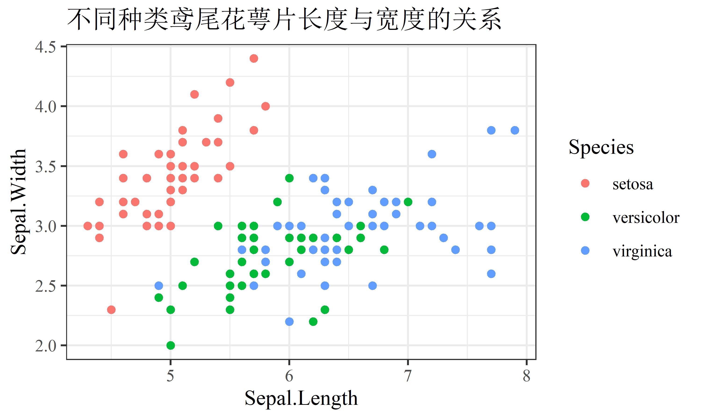
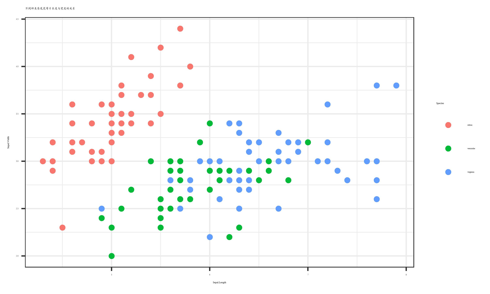
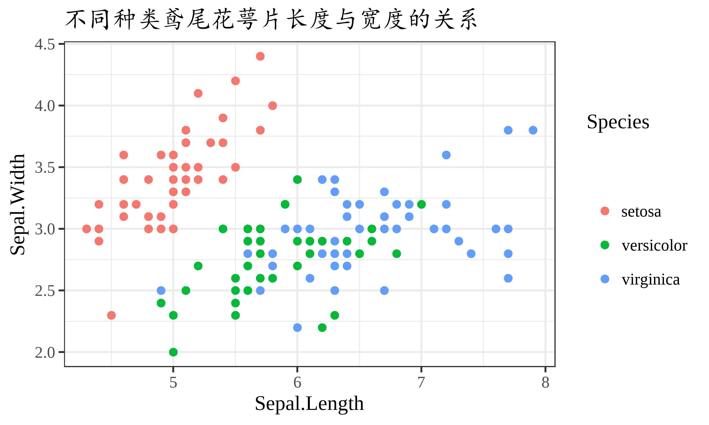

[点击下载本文全部代码](R语言ggplot2设置中文字体_代码.R)

目前，ggplot2包能够正确输出中文，但还仅限于默认的宋体，使用showtext包可以在制图时输出系统安装的其他中文字体。

&nbsp;

# 一、绘制图形

使用R自带的iris数据集绘制一个简单的散点图，并设置一个中文标题，绘制后保存输出。

```r
library(ggplot2)

p <- ggplot(data = iris,
            mapping = aes(x = Sepal.Length,
                          y = Sepal.Width,
                          color = Species)) +
  geom_point() +
  theme_bw() +
  ggtitle("不同种类鸢尾花萼片长度与宽度的关系")
p

ggsave("pic1.jpg", width = 5, height = 3, dpi = 600)
```

查看图片，发现中文标题正确输出，且字体为宋体。



&nbsp;

# 二、设置字体

showtext包的使用包含以下步骤：

1. 加载showtext包；

2. 使用font_add()函数在内存中定义一个字体，本文中将楷体字体的字体文件定义为“Kaiti”；

3. showtext_auto()函数打开自动启用showtext；

4. 在图形中设置文字字体，并绘制和保存。

```r
library(showtext)
font_add("Kaiti", "C:/Windows/Fonts/simkai.ttf")
showtext_auto()

p + theme(plot.title = element_text(family = "Kaiti"))

ggsave("pic2.jpg", width = 5, height = 3, dpi = 600)
```

查看图片发现中文成功以楷体输出，但整个图形的字体大小出现问题，需要进一步完善。



&nbsp;

# 三、完善图片

使用theme()函数中的text属性设置整个图形的字体大小，设置一个比以往更大的值。此外，当字体增大后，图例中标签与文字的间距会增大，因此需要再设置legend.spacing来减小间距。

```r
p + theme(text = element_text(size = 65),
          plot.title = element_text(family = "Kaiti"),
          legend.spacing.x = unit(0, "pt"))

ggsave("pic3.jpg", width = 5, height = 3, dpi = 600)
```

查看图片，此时图片中的所有文字都被正确输出。


