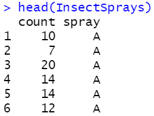
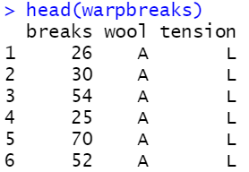
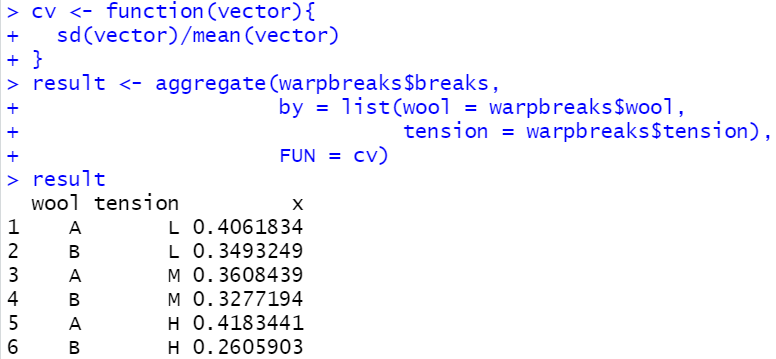

# 一、aggregate()函数

分组计算问题在R语言中有多种处理办法，包括`tapply()`、`group_by()`和`aggregate()`等，其中`aggregate()`是最为出色、灵活和常用的函数。

首先查看`aggregate()`的基本格式：

```r
aggregate(x,                # x是需要被分组计算的值列
          by,               # by是分组的依据列，是一个list对象
          FUN,              # FUN是分组计算使用的统计函数名
          ...,
          simplify = TRUE,  # simplify设置结果是否需要简化
          drop = TRUE)      # drop设置是否去除未被使用的列
```

&nbsp;

# 二、简单分组计算

InsectSprays是R语言的自带数据集，记录了不同杀虫剂使用后的虫子数量，使用`head(InsectSprays)`可以快速浏览数据格式：



如果我们希望评估不同杀虫剂的有效性，就需要计算每种杀虫剂样本的统计值。以下代码实现了计算各种杀虫剂的平均效力。代码中，`InsectSprays$count`是虫子数量列，是要被分组的值列；by需要一个list对象，list内的要素格式为“结果的分组条件列名 = 表中的分组条件列名”，前后列名可以不一致；FUN选择了最普通的均值函数，可以根据需要替换为max, min, median等甚至是自定义的函数，但注意不要添加"()"。

```r
result <- aggregate(x = InsectSprays$count,
                    by = list(spray = InsectSprays$spray),
                    FUN = mean)
result
```

代码运行结果如下：


&nbsp;

# 三、交叉分组计算

warpbreaks是R语言的自带数据集，记录了织布机的异常数据，使用`head(warpbreaks)`进行可以快速浏览数据格式：



当分组条件为多个时，只需要在by属性的list对象内添加多个分组信息。

```r
result <- aggregate(warpbreaks$breaks,
                    by = list(wool = warpbreaks$wool,
                              tension = warpbreaks$tension),
                    FUN = median)
result
```

代码运行结果如下：


&nbsp;

# 四、自定义函数分组计算

由于`aggregate()`函数中FUN属性是不限制函数（能正常使用的前提下）的，因此可以编写自身需要的自定义函数。如以下代码定义了返回标准差与均值的比值，即变异系数。

```r
cv <- function(vector){
  sd(vector)/mean(vector)
}
```

只需要在FUN中调用cv即可计算每个分组的变异系数，继续使用前一个例子的数据。

```r
result <- aggregate(warpbreaks$breaks,
                    by = list(wool = warpbreaks$wool,
                              tension = warpbreaks$tension),
                    FUN = cv)
result
```

代码运行结果如下：


