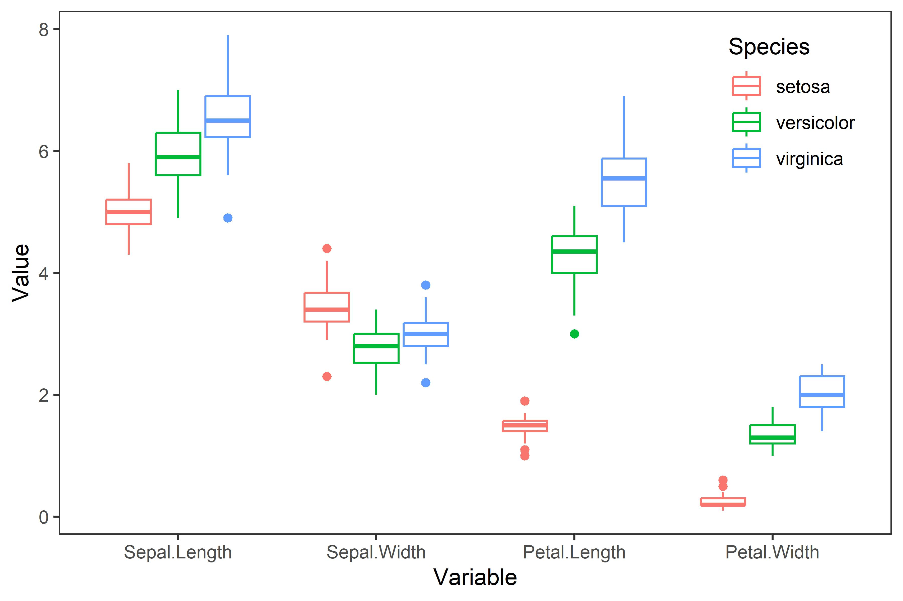
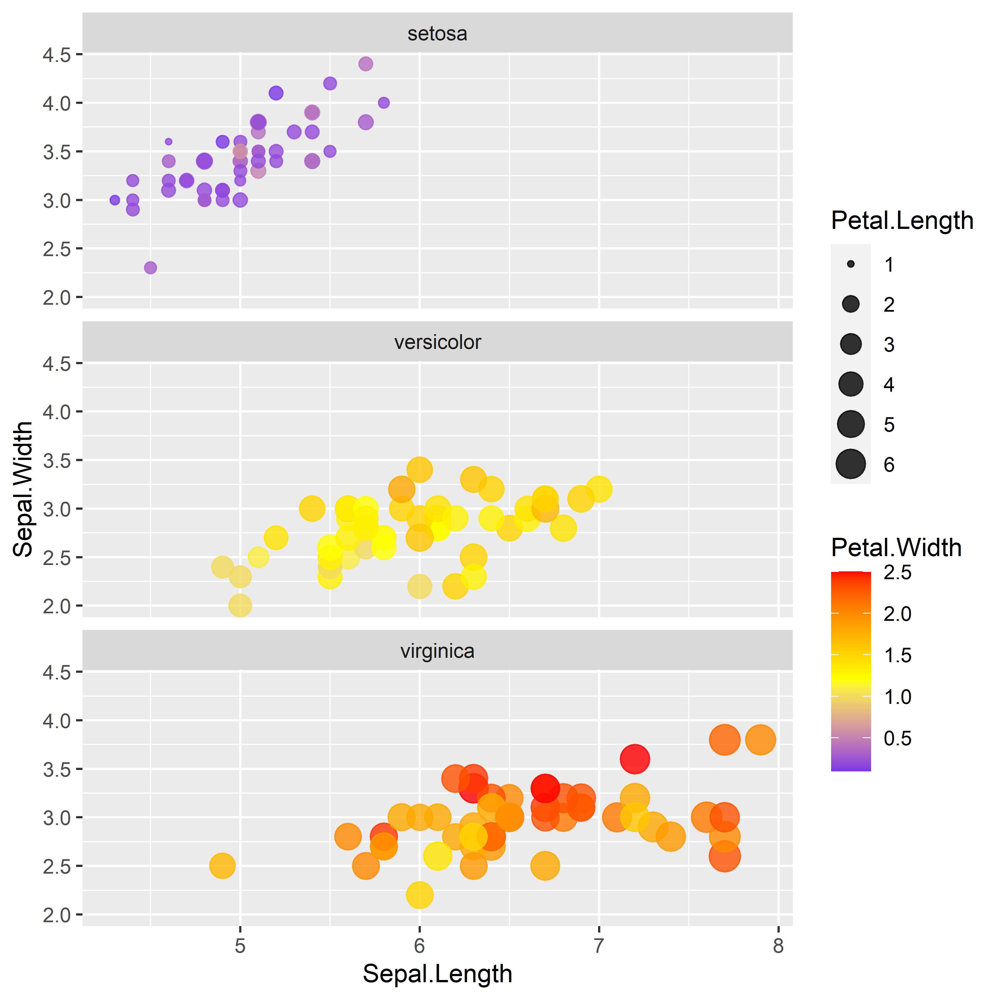

# 一、长格式与宽格式

使用表格存储多变量数据时一般有**长格式**（long-format）与**宽格式**（wide-format）两种。长格式是将多个变量的名称聚成一列作为一个“变量”维度，将多个变量的值聚成一列作为一个“值”维度；宽格式中的每个变量都是一列，作为一个维度。以下为两种格式的示例。

**长格式：**

| 姓名  | 属性  | 值   |
| :---: | :---: | :---: |
| 王一  | 身高  | 175 |
| 王一  | 体重  | 70  |
| 王一  | 血型  | A   |
| 张三  | 身高  | 185 |
| 张三  | 体重  | 80  |
| 张三  | 血型  | AB  |
| 李四  | 身高  | 161 |
| 李四  | 体重  | 51  |
| &nbsp;李四&nbsp;  | &nbsp;血型&nbsp;  | &nbsp;A&nbsp;   |


**宽格式：**

| 姓名  | 身高  | 体重  | 血型  |
| :---: | :---: | :---: | :---: |
| 王一  | 175 | 70  | A   |
| 张三  | 185 | 80  | AB  |
| &nbsp;李四&nbsp;  | &nbsp;&nbsp;161&nbsp;&nbsp; | &nbsp;&nbsp;51&nbsp;&nbsp;  | &nbsp;&nbsp;&nbsp;A&nbsp;&nbsp;&nbsp;   |

&nbsp;

# 二、为什么需要对数据进行转换

多变量数据的长宽格式有各自的特点和优势，因此不同的需求就需要有不同的方式来展现和表达。此外，不同函数也常常对应着不同的格式数据。

&nbsp;

# 三、使用reshape2包进行转换

`reshape2::melt()`函数可以将宽格式转为长格式。

```r
melt(data,                    # 输入的数据集
     id.vars,                 # 不需要进行合并的非变量名称
     measure.vars,            # 需要进行合并的变量名称
     ...,
     na.rm = FALSE,           # 是否去除缺失值
     variable.name = ,        # 转换后“变量”列的名称
     value.name = 'value',)   # 转换后“值”列的名称
```

`reshape2::dcast()`函数可以将长格式转为宽格式。

```r
dcast(data,                   # 输入的数据集
      formula,                # 需要拆散的方式，格式为“非变量列 ~ 变量列”
      ...,
      value.var = "value",    # “值”列的名称
      fun.aggregate = NULL)   # 若拆散后
```
&nbsp;


# 四、实践应用

以R自带的iris数据集为例，使用`head(iris)`查看一下数据：

|   &nbsp;&nbsp;&nbsp;&nbsp;&nbsp;  | Sepal.Length&nbsp;&nbsp;&nbsp;&nbsp; | Sepal.Width&nbsp;&nbsp;&nbsp;&nbsp; | Petal.Length&nbsp;&nbsp;&nbsp;&nbsp; | Petal.Width&nbsp;&nbsp;&nbsp;&nbsp; | Species&nbsp;&nbsp;&nbsp;&nbsp; |
| --- | ------------ | ----------- | ------------ | ----------- | ------- |
| 1   | 5.1          | 3.5         | 1.4          | 0.2         | setosa  |
| 2   | 4.9          | 3           | 1.4          | 0.2         | setosa  |
| 3   | 4.7          | 3.2         | 1.3          | 0.2         | setosa  |
| 4   | 4.6          | 3.1         | 1.5          | 0.2         | setosa  |
| 5   | 5            | 3.6         | 1.4          | 0.2         | setosa  |
| 6   | 5.4          | 3.9         | 1.7          | 0.4         | setosa  |

若需要绘制不同种类鸢尾花四个属性的值的分布情况，则需要先转为长格式。在此之前，因该数据无样本编号，因此添加一列索引编号。

```r
data <- iris
data$Index <- 1:nrow(data)

data_long <- melt(data = data, 
                  id.vars = c("Species","Index"))
```

使用`head(data_long)`查看data_long结果如下：

|   &nbsp;&nbsp;&nbsp;&nbsp;&nbsp;  | Species&nbsp;&nbsp; &nbsp;&nbsp; |Index&nbsp;&nbsp; &nbsp;&nbsp;&nbsp;&nbsp; | variable&nbsp;&nbsp;&nbsp;&nbsp;&nbsp;&nbsp;     | value&nbsp;&nbsp;&nbsp;&nbsp; |
| --- | ------- | ----- | ------------ | ----- |
| 1   | setosa  | 1     | Sepal.Length | 5.1   |
| 2   | setosa  | 2     | Sepal.Length | 4.9   |
| 3   | setosa  | 3     | Sepal.Length | 4.7   |
| 4   | setosa  | 4     | Sepal.Length | 4.6   |
| 5   | setosa  | 5     | Sepal.Length | 5     |
| 6   | setosa  | 6     | Sepal.Length | 5.4   |

此时可使用ggplot2中的`geom_boxplot()`函数进行绘制：

```r
ggplot(data = data_long,
       mapping = aes(x = Variable, y = Value, color = Species))+
          geom_boxplot()+
          theme_bw()+
          theme(panel.grid.major = element_blank(),
             panel.grid.minor = element_blank(),
             legend.position = c(0.88,0.82))
```



若data_long就是获得的原始数据，而此时希望绘制萼片长度（Sepal.Length）与萼片宽度（Sepal.Width）的散点图，同时还要表现出其他三个属性的维度，则需要将数据的维度增加，即转为宽数据。使用以下代码进行转换：

```r
data_wide <- dcast(data = data_long,
                   formula = Index + Species ~ variable,
                   value.var = "value",
                   fun.aggregate = NULL)
```

使用`head(data_wide)`查看一下数据：

|  &nbsp;&nbsp;&nbsp;&nbsp;&nbsp;   | Index &nbsp;&nbsp;&nbsp;&nbsp; | Species&nbsp;&nbsp;  | &nbsp;&nbsp;Sepal.Length&nbsp;&nbsp;&nbsp;&nbsp; | Sepal.Width&nbsp;&nbsp;&nbsp;&nbsp; | Petal.Length&nbsp;&nbsp;&nbsp;&nbsp; | Petal.Width&nbsp;&nbsp;&nbsp;&nbsp; |
| --- | ----- | ------- | ------------ | ----------- | ------------ | ----------- |
| 1   | 1     | setosa  | 5.1          | 3.5         | 1.4          | 0.2         |
| 2   | 2     | setosa  | 4.9          | 3           | 1.4          | 0.2         |
| 3   | 3     | setosa  | 4.7          | 3.2         | 1.3          | 0.2         |
| 4   | 4     | setosa  | 4.6          | 3.1         | 1.5          | 0.2         |
| 5   | 5     | setosa  | 5            | 3.6         | 1.4          | 0.2         |
| 6   | 6     | setosa  | 5.4          | 3.9         | 1.7          | 0.4         |

此时可使用ggplot2中的`geom_point()`搭配`facet_wrap()`函数进行绘制：

```r
data$Petal.Length <- data$Petal.Length/max(data$Petal.Length)
ggplot(data = data_wide,
       mapping = aes(x = Sepal.Length,
                     y = Sepal.Width,
                     size = Petal.Length,
                     color = Petal.Width))+
          geom_point(alpha = 0.8)+
          facet_wrap(Species~., nrow = 3)+
          scale_color_gradient2(low = "blue",
                                mid = "yellow",
                                high = "red",
                                midpoint = mean(data_wide$Petal.Width))
```


