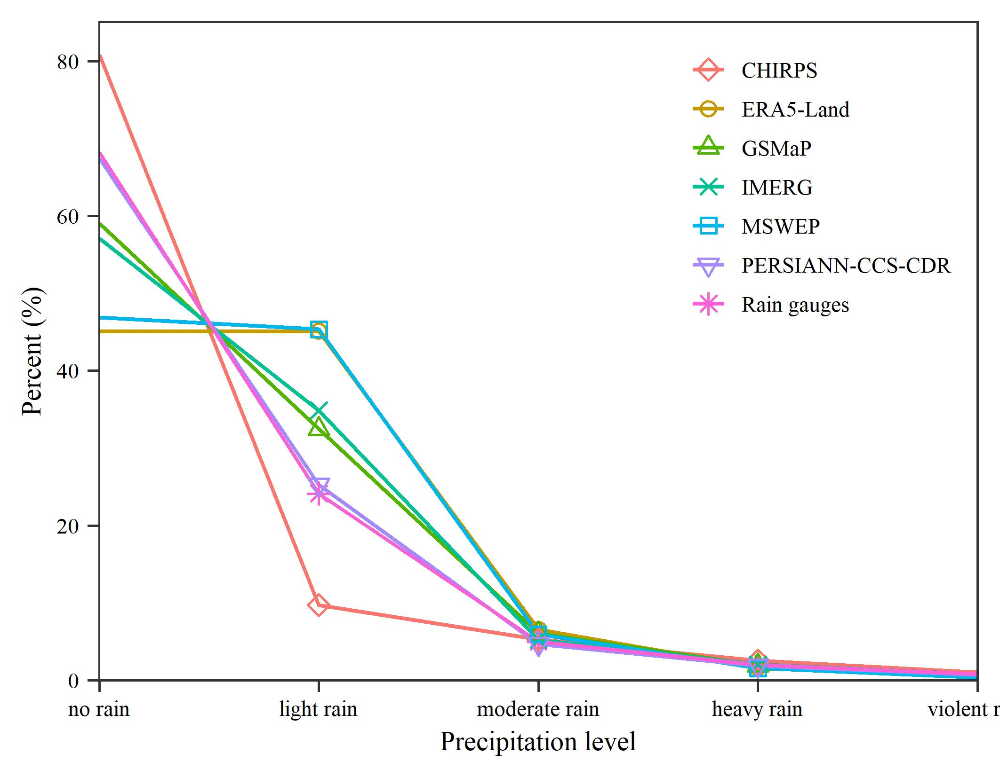
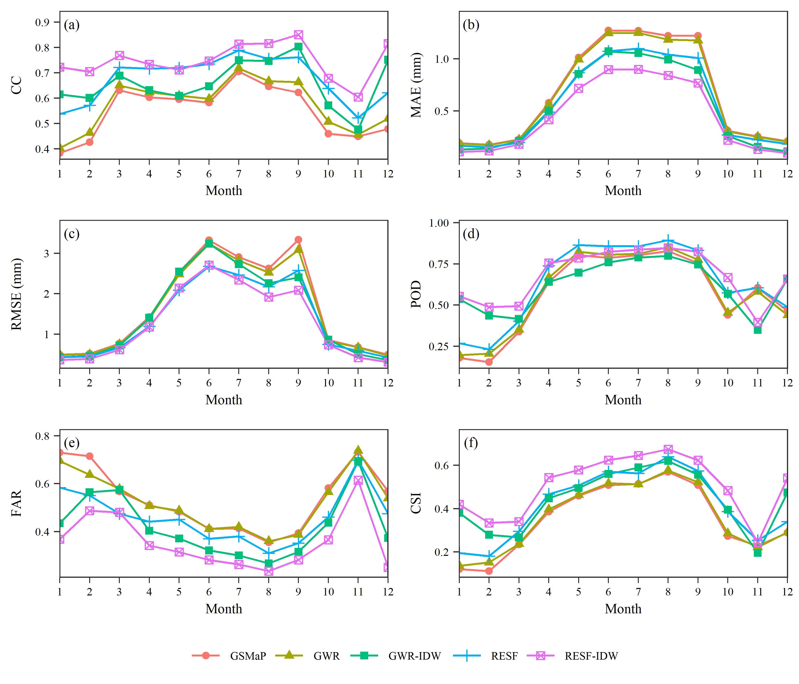

[点击下载本文全部代码](R语言折线图绘制模板_代码.R)

[点击下载本文全部数据](R语言折线图绘制模板_数据.zip)

在熟悉绘图函数及其参数设置后，形成一套通用模板有助于提高制图效率。本文展示了几种基于R语言ggplot2包的折线图绘制代码。

--- 

# 一、单一折线图

```r
## library
library(ggplot2)

## read data
data <- read.csv("fig1.csv")
data$Level <- factor(data$Level,
                     levels = c('no rain',
                                'light rain',
                                'moderate rain',
                                'heavy rain',
                                'violent rain'))
data2 <- data[data$Level %in% c("light rain",
                                "moderate rain",
                                "heavy rain"),]
shape_list7 <- c(5,1,2,4,0,6,8)
## plot
ggplot(data = data,
       mapping = aes(x = Level,
                     y = Percent,
                     group = Product,
                     color = Product))+
  geom_line(linewidth = 0.5) +
  geom_point(data = data2,
             aes(shape = Product)) +
  labs(x = "Precipitation level",
       y = "Percent (%)")+
  scale_x_discrete(expand = c(0.001,0))+
  scale_y_continuous(limits = c(0,85),
                     expand = c(0.0015,0))+
  scale_shape_manual(values=shape_list7) +
  theme_bw() +
  theme(text = element_text(family="serif",
                            size = 7),
        panel.grid = element_blank(),
        panel.border = element_rect(linewidth = 0.5),
        legend.position = c(0.82, 0.76),
        legend.title = element_blank(),
        legend.box.spacing = unit(0, "cm"),
        legend.key.size = unit(10, "pt"),
        legend.background = element_blank(),
        axis.ticks = element_line(linewidth = 0.3),
        axis.line = element_blank(),
        axis.text = element_text(color = "black"))

## save
ggsave("fig1.jpg",
       width = 9,
       height = 7,
       units = "cm",
       dpi = 600)
```



# 二、多折线图

```r
## library
library(ggplot2)
library(ggpubr)

## read data
re <- read.csv("fig2.csv")
re$Station <- as.character(re$Station)

## plotfun
plotfun <- function(data,
                    ylab,
                    label,
                    yexpand=0.05){
  ggplot(data = data,
         mapping = aes(x = Month, 
                       y = Values,
                       color = Method,
                       shape = Method))+
    geom_line()+
    geom_point()+
    scale_y_continuous(expand = c(yexpand,0,0.1,0))+
    scale_x_continuous(expand = c(0.001,0),
                       n.breaks = 12)+
    labs(x = "Month", y = ylab)+
    annotate("text",
             x = 1.4,
             y = max(data$Values)*1.05,
             label = label,
             family="serif", size = 2.5) +
    theme_bw() +
    theme(text=element_text(family="serif",
                            size = 7),
          panel.grid = element_blank(),
          panel.border = element_rect(linewidth = 0.5),
          legend.title = element_blank(),
          legend.key = element_rect(fill = "transparent"),
          axis.ticks.x = element_line(linewidth = 0.28),
          axis.ticks.y = element_line(linewidth = 0.3),
          axis.text = element_text(color = "black"))
}

## plot
a <- plotfun(re[re$Metric=="CC",], "CC", "(a)")
b <- plotfun(re[re$Metric=="MAE",], "MAE (mm)", "(b)")
c <- plotfun(re[re$Metric=="RMSE",], "RMSE (mm)", "(c)")
d <- plotfun(re[re$Metric=="POD",], "POD", "(d)")
e <- plotfun(re[re$Metric=="FAR",], "FAR", "(e)")
f <- plotfun(re[re$Metric=="CSI",], "CSI", "(f)")

ggarrange(a,b,c,d,e,f,
          ncol = 2,
          nrow = 3,
          align = "hv",
          common.legend = T,
          legend = "bottom")

## save
ggsave("fig2.jpg",
       width = 14,
       height = 12,
       units = "cm",
       dpi = 600)
```


