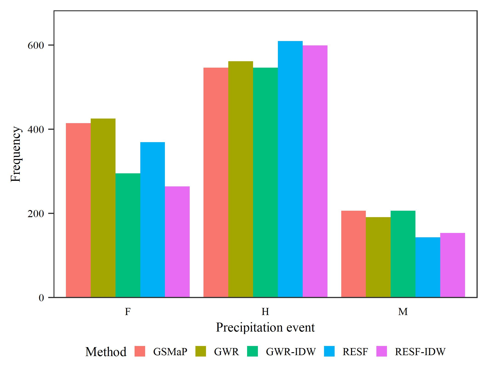
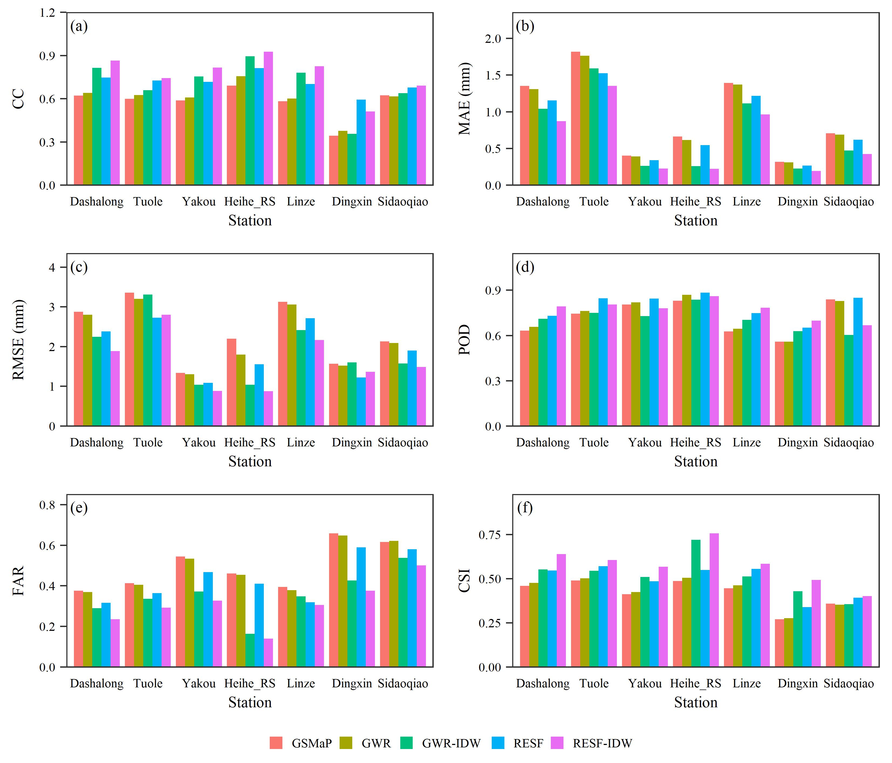

[点击下载本文全部代码](R语言柱状图绘制模板_代码.R)

[点击下载本文全部数据](R语言柱状图绘制模板_数据.zip)

在熟悉绘图函数及其参数设置后，形成一套通用模板有助于提高制图效率。本文展示了几种基于R语言ggplot2包的柱状图绘制代码。

--- 

# 一、单一柱状图

```r
## library
library(ggplot2)

## read data
re <- NULL
for (var in 1:4) {
  for (s in unique(iris$Species)){
    value <- c(mean(iris[iris$Species == s,var]),
               sd(iris[iris$Species == s,var]))
    lins <- data.frame(attr = colnames(iris)[var],
                       species = s,
                       mean = value[1],
                       sd = value[2])
    re <- rbind(re, lins)
  }
}

## plot
ggplot(data = re,
       mapping = aes(x = attr,
                     y = mean,
                     fill = species))+
  geom_col(position = 'dodge')+
  geom_errorbar(aes(ymin = mean - sd,
                    ymax = mean + sd),
                width = 0.3,
                linewidth = 0.3,
                position = position_dodge(0.9))+
  labs(y = "Length/weight (cm)",
       x = "Attribute name")+
  scale_x_discrete(expand = c(0.18,0.18))+
  scale_y_continuous(expand = c(0.002,0,0.12,0))+
  theme_bw() +
  theme(text = element_text(family="serif",
                            size = 7),
        panel.grid = element_blank(),
        legend.position = c(0.11, 0.9),
        legend.title = element_blank(),
        legend.box.spacing = unit(0, "cm"),
        legend.key.size = unit(7, "pt"),
        legend.background = element_blank(),
        axis.ticks.x = element_blank(),
        axis.ticks.y = element_line(linewidth = 0.3),
        axis.text = element_text(color = "black"))

## save
ggsave("fig1.jpg",
       width = 9,
       height = 7,
       units = "cm",
       dpi = 600)
```



# 二、多柱状图

```r
## library
library(ggplot2)
library(ggpubr)

## read data
re <- read.csv("fig2.csv")
re$Station <- as.character(re$Station)

## plotfun
plotfun <- function(data, ylab, label){
  ggplot(data = data,
         mapping = aes(x = Station,
                       y = Values,
                       fill = Method)) +
    geom_col(position = 'dodge') +
    scale_y_continuous(expand = c(0.0035,0,0.08,0)) +
    scale_x_discrete(labels = c("Dashalong",
                                "Tuole",
                                "Yakou",
                                "Heihe_RS",
                                "Linze",
                                "Dingxin",
                                "Sidaoqiao")) +
    labs(x = "Station",
         y = ylab) +
    annotate("text",
             x = 0.65,
             y = max(data$Values)*1.2,
             label = label,
             family="serif",
             size = 2.5) +
    theme_bw() +
    theme(text = element_text(family="serif",
                              size = 7),
          panel.grid = element_blank(),
          legend.position = "bottom",
          legend.title = element_blank(),
          legend.key.size = unit(7, "pt"),
          legend.box.spacing = unit(0, "cm"),
          axis.ticks.x = element_blank(),
          axis.ticks.y = element_line(linewidth=0.3),
          axis.text = element_text(color = "black"))
}

## plot
a <- plotfun(re[re$Metric=="CC",], "CC", "(a)")
b <- plotfun(re[re$Metric=="MAE",], "MAE (mm)", "(b)")
c <- plotfun(re[re$Metric=="RMSE",], "RMSE (mm)", "(c)")
d <- plotfun(re[re$Metric=="POD",], "POD", "(d)")
e <- plotfun(re[re$Metric=="FAR",], "FAR", "(e)")
f <- plotfun(re[re$Metric=="CSI",], "CSI", "(f)")

ggarrange(a,b,c,d,e,f,
          ncol = 2,
          nrow = 3,
          align = "hv",
          common.legend = T,
          legend = "bottom")

## save
ggsave("fig2.jpg",
       width = 14,
       height = 12,
       units = "cm",
       dpi = 600)
```


