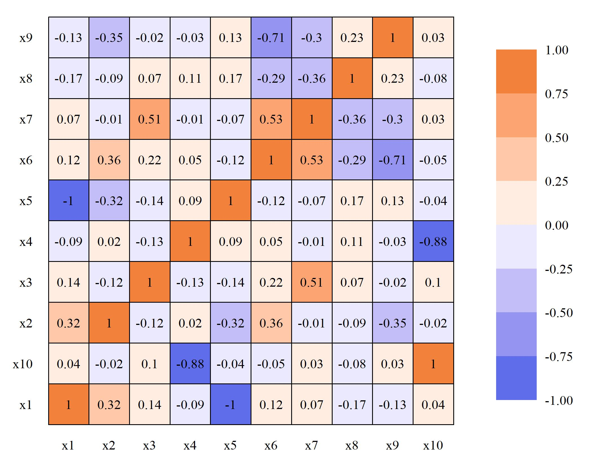
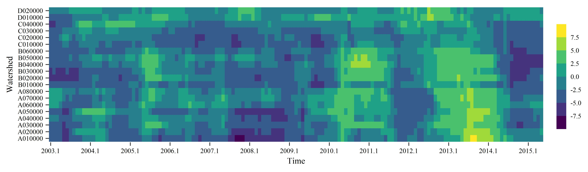
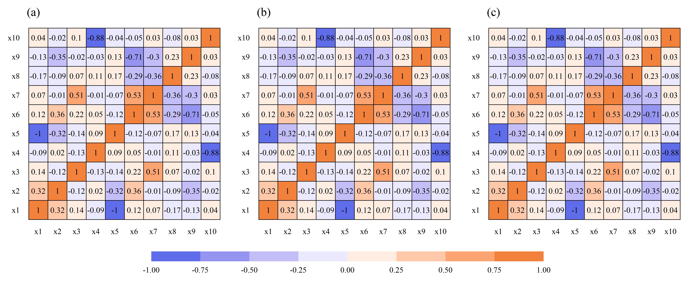

[点击下载本文全部代码](R语言热图绘制模板_代码.R)

[点击下载本文全部数据](R语言热图绘制模板_数据.zip)

在熟悉绘图函数及其参数设置后，形成一套通用模板有助于提高制图效率。本文展示了两种基于R语言ggplot2包的热图绘制代码。

--- 

# 一、相关系数图

```r
## library
library(ggplot2)

## read data
data <- read.csv("fig1.csv")
data$Var1 <- factor(data$Var1, levels = paste0("x",1:10))

## plot
ggplot(data = data,
       mapping = aes(x = Var1,
                     y = Var2,
                     fill = value))+
  geom_tile(color = "black",
            linewidth = 0.2)+
  scale_fill_steps2(low = "#375AE6",
                    mid = "white",
                    high = "#EB6F1A",
                    na.value = "grey",
                    breaks = seq(-1,1,0.25),
                    limits = c(-1,1))+
  geom_text(data = data, mapping = aes(label = round(value, 2)),
            family = "serif", size = 2)+
  labs(x = NULL, y = NULL, fill = NULL)+
  theme_bw()+
  theme(text = element_text(family = "serif",
                            size = 7),
        panel.grid = element_blank(),
        panel.border = element_blank(),
        legend.key.height = unit(30,"pt"),
        axis.text = element_text(color = "black"),
        axis.ticks = element_blank())

## save
ggsave("fig1.jpg",
       width = 9,
       height = 7,
       units = "cm",
       dpi = 600)
```



# 二、时空状态图

```r
## library
library(ggplot2)
library(RColorBrewer)

## read data
data <- read.csv("fig2.csv")
data <- data[data$WRRCD %in% unique(data$WRRCD)[1:20],]
data <- data[data$No < 150,]

## plot
ggplot(data = data,aes(x=No,y=WRRCD,fill=PDSI))+
  geom_tile() +
  scale_x_continuous(expand = c(0,0),
                     breaks = seq(1,228,12),
                     labels = seq(2003.1,2021.1,1))+
  scale_fill_viridis_b(n.breaks = 7)+
  labs(x = "Time", y= "Watershed") +
  theme_bw() +
  theme(text = element_text(family = "serif",
                            size = 7),
        panel.grid = element_blank(),
        panel.border = element_blank(),
        legend.title = element_blank(),
        legend.margin = margin(0,0,0,0),
        legend.key.width = unit(8,"pt"),
        axis.ticks = element_line(linewidth = 0.3),
        axis.text = element_text(color = "black"))

## save
ggsave("fig2.jpg",
       width = 17,
       height = 5,
       units = "cm",
       dpi = 600)
```



# 三、相关系数图（多图）

```r
## library
library(ggplot2)
library(ggpubr)

## read data
data <- read.csv("fig1.csv")
data$Var1 <- factor(data$Var1, levels = paste0("x",1:10))
data$Var2 <- factor(data$Var2, levels = paste0("x",1:10))

## plotfun
plotfun <- function(data, title){
  ggplot(data = data,
         mapping = aes(x = Var1,
                       y = Var2,
                       fill = value))+
    geom_tile(color = "black",
              linewidth = 0.2)+
    scale_fill_steps2(low = "#375AE6",
                      mid = "white",
                      high = "#EB6F1A",
                      na.value = "grey",
                      breaks = seq(-1,1,0.25),
                      limits = c(-1,1))+
    geom_text(data = data, mapping = aes(label = round(value, 2)),
              family = "serif", size = 2)+
    labs(x = NULL, y = NULL, fill = NULL, title = title)+
    theme_bw()+
    theme(text = element_text(family = "serif",
                              size = 7),
          panel.grid = element_blank(),
          #plot.title = element_text(size = 7),
          panel.border = element_blank(),
          legend.key.width = unit(55,"pt"),
          legend.key.height = unit(7,"pt"),
          axis.text = element_text(color = "black"),
          axis.ticks = element_blank())
}

# plot
a <- plotfun(data, "(a)")
b <- plotfun(data, "(b)")
c <- plotfun(data, "(c)")

ggarrange(a, b, c,
          ncol = 3,
          common.legend = T,
          legend = "bottom")

## save
ggsave("fig3.jpg",
       width = 17,
       height = 7,
       units = "cm",
       dpi = 800)
```


