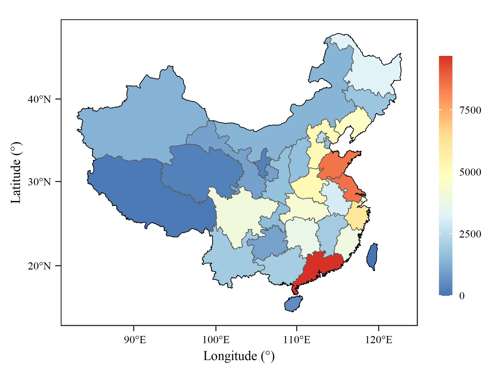
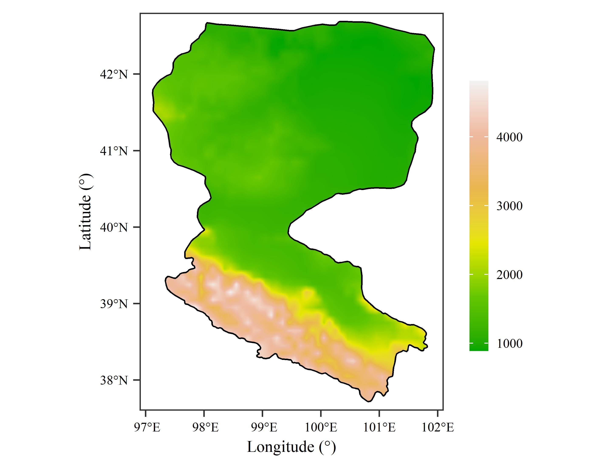
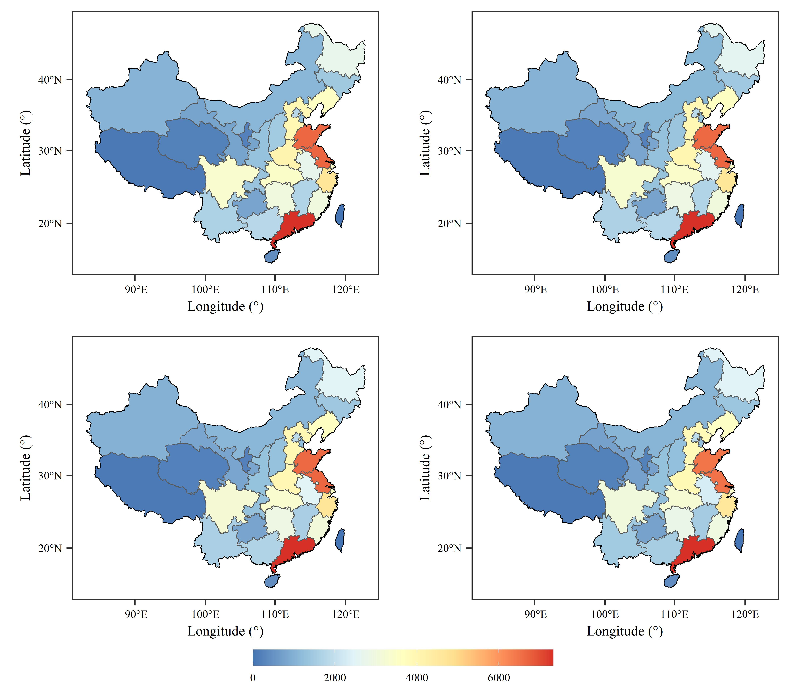
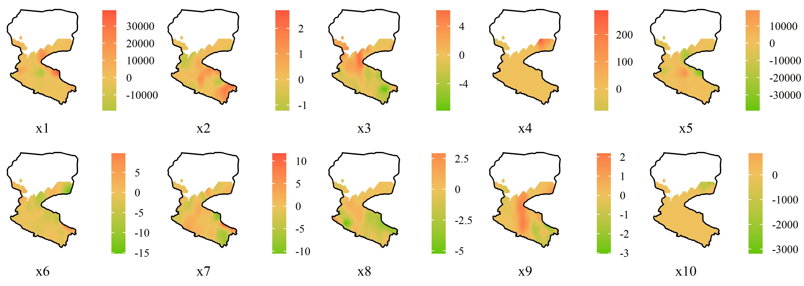

[点击下载本文全部代码](R语言空间分布图绘制模板_代码.R)

[点击下载本文全部数据](R语言空间分布图绘制模板_数据.zip)

在熟悉绘图函数及其参数设置后，形成一套通用模板有助于提高制图效率。本文展示了两种基于R语言ggplot2包的空间分布图绘制代码。

--- 

# 一、单一矢量图

```r
## library
library(sf)
library(ggplot2)

## read data
Boundary_China <- st_read('Boundary_China.shp')
Province_China <- st_read('Province_China.shp')

## plot
ggplot()+
  geom_sf(data = Province_China,
          aes(fill = GDP_2000.)) + 
  geom_sf(data = Boundary_China,
          fill = "transparent",
          color = "black",
          linewidth = 0.2)+
  coord_sf(crs = st_crs(Province_China)) +
  scale_fill_distiller(palette = "RdYlBu") +
  labs(x = "Longitude (°)",
       y = "Latitude (°)") +
  theme_bw() +
  theme(text = element_text(family = "serif",
                            size = 7),
        panel.grid = element_blank(),
        legend.key.width = unit(7, "pt"),
        legend.key.height = unit(25, "pt"),
        legend.margin = margin(0,0,0,0),
        legend.title = element_blank(),
        axis.ticks = element_line(linewidth = 0.3),
        axis.text = element_text(color = "black"))

## save
ggsave("fig1.jpg",
       width = 9,
       height = 7,
       units = "cm",
       dpi = 600)
```



# 二、单一栅格图

```r
## library
library(raster)
library(ggplot2)

## read data
Boundary_Heihe <- st_read('Boundary_Heihe.shp')
Elevation_Heihe <- raster("Elevation_Heihe.tif")

Elevation_Heihe_mask <- mask(Elevation_Heihe,Boundary_Heihe)
Elevation_Heihe_mask_df <- as.data.frame(as(Elevation_Heihe_mask,"Raster"),
                                         xy=T)

## plot
ggplot() +
  geom_raster(data = Elevation_Heihe_mask_df,
              mapping = aes(x=x,
                            y=y,
                            fill = Elevation_Heihe)) + 
  geom_sf(data = Boundary_Heihe,
          color = "black",
          fill = "transparent",
          linewidth = 0.3)+
  scale_fill_gradientn(colors = terrain.colors(6),
                       na.value = "transparent",
                       n.breaks = 5) +
  scale_x_continuous(limits = c(96.9,102.1),
                     expand = c(0,0)) +
  scale_y_continuous(limits = c(37.6,42.8)
                     ,expand = c(0,0)) +
  labs(x = "Longitude (°)",
       y = "Latitude (°)") +
  theme_bw() +
  theme(text = element_text(family = "serif",
                            size = 7),
        panel.grid = element_blank(),
        legend.margin = margin(0,0,0,0),
        legend.title = element_blank(),
        legend.key.height = unit(23, "pt"),
        legend.key.width = unit(8, "pt"),
        axis.text = element_text(color = "black"),
        axis.ticks = element_line(linewidth = 0.3))

## save
ggsave("fig2.jpg",
       width = 9,
       height = 7,
       units = "cm",
       dpi = 800)
```



# 三、多矢量图

```r
## library
library(sf)
library(ggplot2)
library(ggpubr)

## read data
Boundary_China <- st_read('Boundary_China.shp')
Province_China <- st_read('Province_China.shp')

## plotfun
plotfun <- function(fillname, title){
  ggplot()+
    geom_sf(data = Province_China,
            aes_string(fill = fillname)) + 
    geom_sf(data = Boundary_China,
            fill = "transparent",
            color = "black",
            linewidth = 0.2)+
    coord_sf(crs = st_crs(Province_China)) +
    scale_fill_distiller(palette = "RdYlBu") +
    labs(x = "Longitude (°)",
         y = "Latitude (°)") +
    theme_bw() +
    theme(text = element_text(family = "serif",
                              size = 7),
          panel.grid = element_blank(),
          legend.key.width = unit(30, "pt"),
          legend.key.height = unit(8, "pt"),
          legend.margin = margin(0,0,0,0),
          legend.title = element_blank(),
          axis.ticks = element_line(linewidth = 0.3),
          axis.text = element_text(color = "black"))
}

a <- plotfun("GDP_1997.", "(a)")
b <- plotfun("GDP_1998.", "(b)")
c <- plotfun("GDP_1999.", "(c)")
d <- plotfun("GDP_2000.", "(d)")

ggarrange(a, b, c, d,
          ncol = 2,
          nrow = 2,
          common.legend = T,
          legend = "bottom")

## save
ggsave("fig3.jpg",
       width = 14,
       height = 12,
       units = "cm",
       dpi = 800)
```



# 四、多栅格图

```r
## library
library(raster)
library(ggpubr)
library(ggplot2)
library(sf)

## read data
load("20170904.RData")
Boundary_Heihe <- st_read('Boundary_Heihe.shp')

## function
fmt_dcimals <- function(decimals=0){
  function(x) as.character(round(x,decimals))
}

plotfun <- function(df, caption){
  options(digits=2)
  ggplot()+
    geom_tile(data=df,aes(x = x,
                          y = y,
                          fill = layer))+
    geom_sf(data = Boundary_Heihe,
            color = "black",
            fill = "transparent",
            linewidth = 0.3)+
    scale_fill_gradient2(low = "#63C601",
                         high = "#FF543F",
                         mid = "#EFC15C",
                         na.value="transparent",
                         midpoint = 0,
                         labels = fmt_dcimals(2))+
    labs(caption = caption)+
    scale_x_continuous(limits = c(97,102.1),expand = c(0,0))+
    scale_y_continuous(limits = c(37.6,42.8),expand = c(0,0))+
    theme_bw()+
    theme(text = element_text(family = "serif",
                              size = 7),
          panel.grid = element_blank(),
          panel.border = element_blank(),
          legend.key.height = unit(10, "pt"),
          legend.key.width = unit(7, "pt"),
          plot.margin = margin(0,0,0,0),
          legend.margin = margin(0,0,0,0),
          plot.caption = element_text(hjust = 0.5,
                                      size = 7),
          legend.title = element_blank(),
          axis.text = element_blank(),
          axis.ticks = element_blank(),
          axis.title = element_blank())
}

# plot
plots <- list()
for (plotno in 2:11){
  r <- raster(gwr.coef001[,,plotno], xmn = 96, xmx = 103, ymn = 36, ymx = 44)
  mask_area <- mask(r,Boundary_Heihe)
  df<- as.data.frame(as(mask_area,"Raster"),xy=T)

  a <- plotfun(df, paste0("x",plotno-1))
  plots<-append(plots,list(a))
}

ggarrange(plotlist = plots,
          nrow=2, ncol = 5,
          align = "hv")

## save
ggsave("fig4.jpg",
       width = 14,
       height = 5,
       units = "cm",
       dpi = 800)
```


