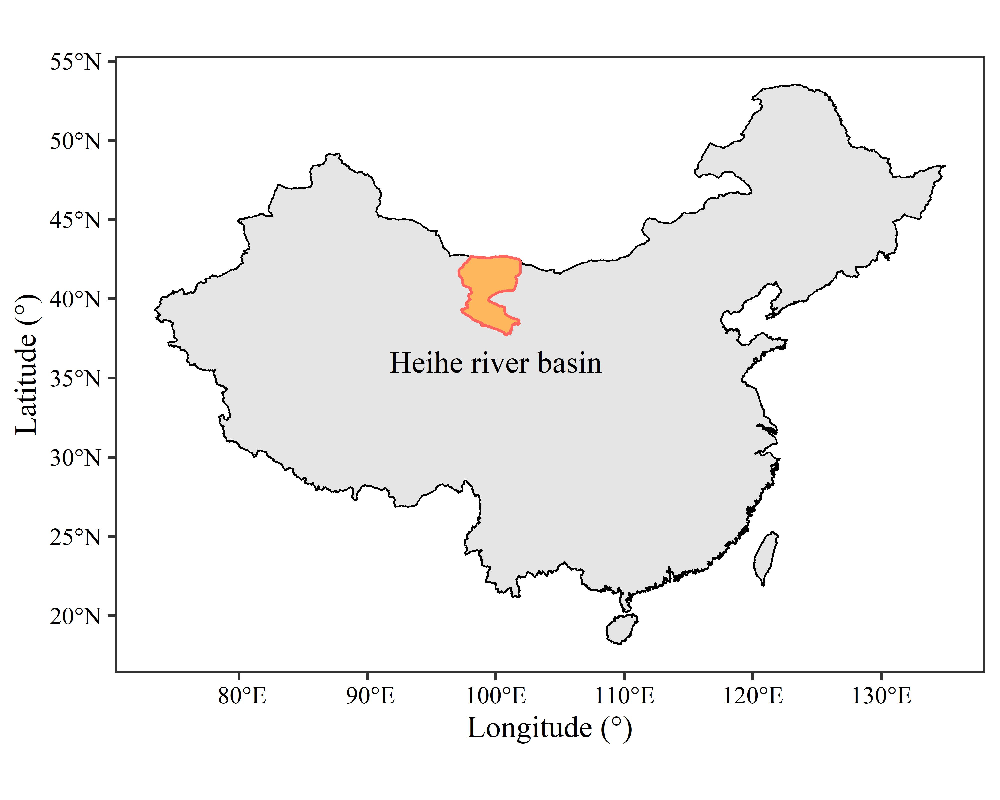
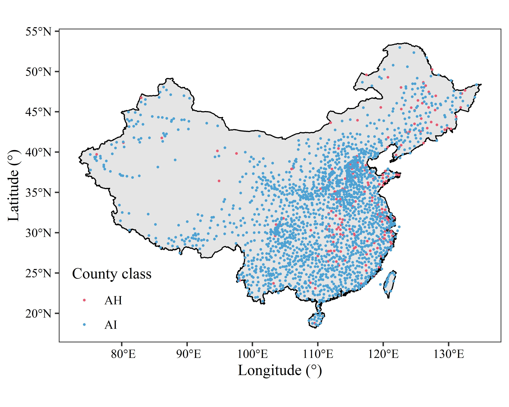
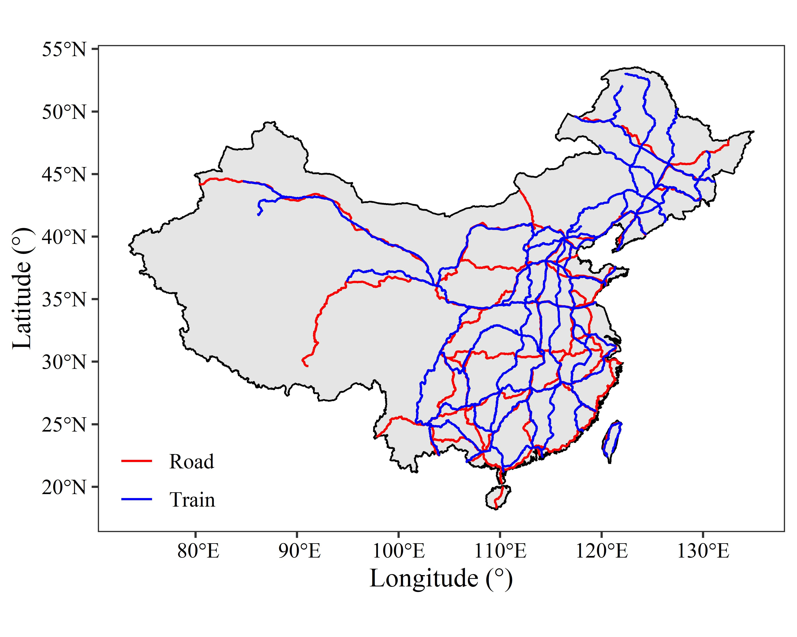
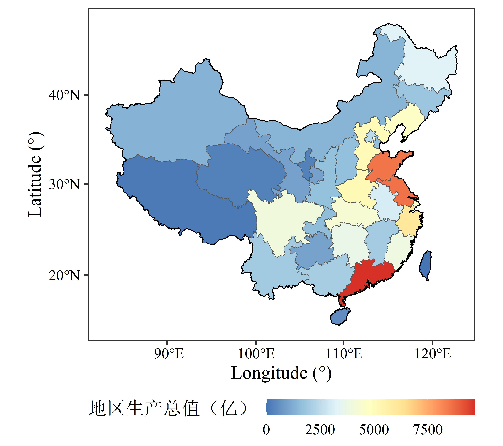
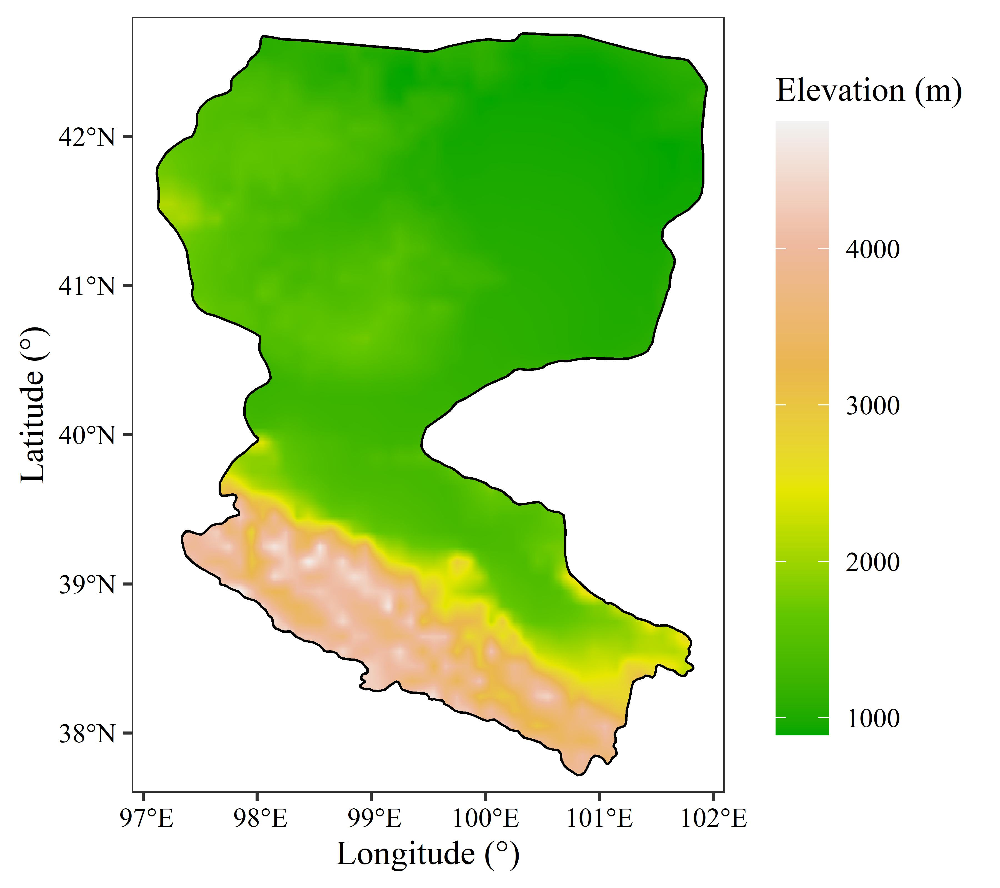
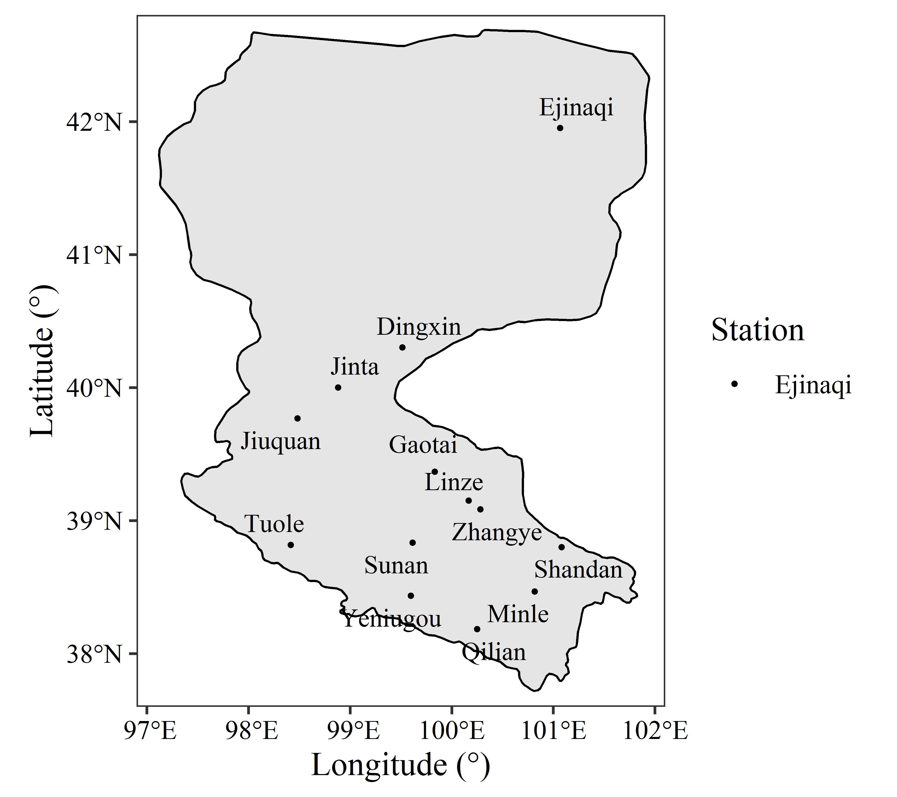
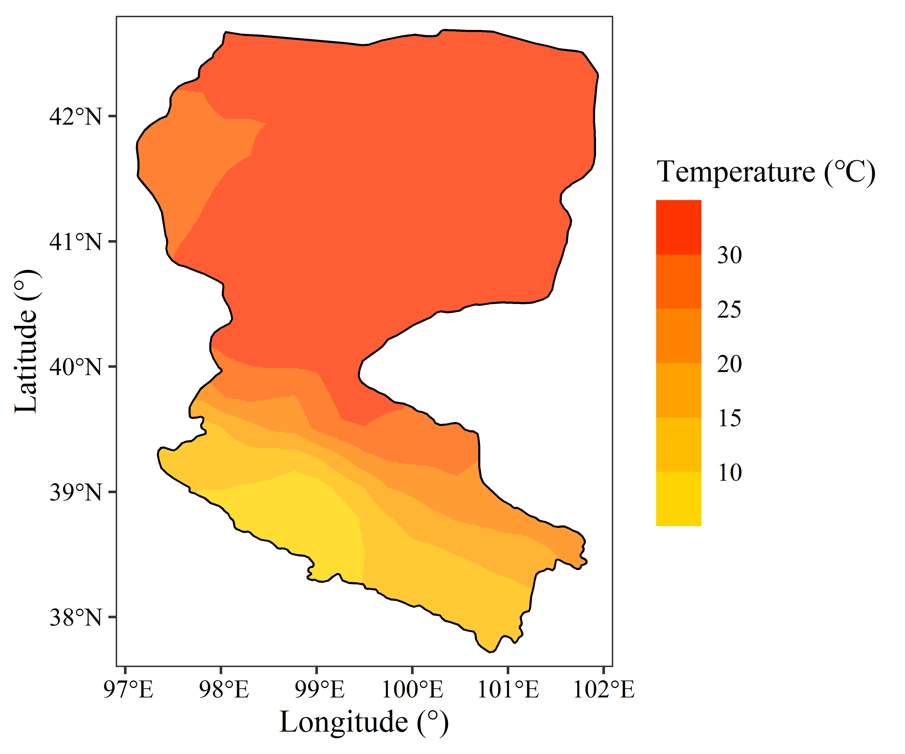

[点击下载本文全部代码](R语言空间数据可视化_代码.R)

[点击下载本文全部数据](R语言空间数据可视化_数据.zip)

在地理研究中，空间数据可视化是不可缺少的环节，也是论文中最常见的图形。本文使用ggplot2包分别展示了矢量和栅格数据的可视化方法。使用的原始数据包括最常见的shp矢量文件与tif栅格文件，也包括使用csv表格存储的点数据与栅格数据。

本文注重空间数据可视化，关于ggplot2包的基本函数，如theme()、labs()等请参考[ggplot作图入门教程](https://www.math.pku.edu.cn/teachers/lidf/docs/Rbook/html/_Rbook/ggplot2.html)；关于scale_color_stepsn()等颜色设置函数请参考之前的post——[R语言ggplot2包的颜色设置 | Xiaoran Wu](https://www.wuxiaoran.top/post/r%E8%AF%AD%E8%A8%80ggplot2%E5%8C%85%E7%9A%84%E9%A2%9C%E8%89%B2%E8%AE%BE%E7%BD%AE/)；关于综合制图所需要的比例尺、指北针等制图要素请关注下一篇post。

&nbsp;

# 一、加载包与数据

## 1. Package

本文共使用4个包：

- 矢量数据处理（sf）

- 栅格数据处理（raster）

- 绘图（ggplot2）

- 绘制防压盖标签（ggrepel，ggplot2的一个增强补充包）

```r
library(sf)
library(raster)
library(ggplot2)
library(ggrepel)
```

## 2. 数据

本文共使用以下数据：

- Boundary_China：中国地面范围（面）

- County_China：中国县级行政单位（点）

- Province_China：中国的省级行政单位（面）

- Road_China：中国国道路线（线）

- Train_China：中国铁路路线（线）

- Boundary_Heihe：中国黑河流域范围（面）

- Elevation_Heihe：中国黑河区域高程数据（栅格）

- Station_Heihe：中国黑河流域气象站点位置（表格）

- temperature_Heihe：中国黑河流域ERA5地面温度数据（表格）

分别使用`st_read()`函数、`raster()`函数与`read.csv()`函数读取矢量、栅格与表格数据。

```r
Boundary_China <- st_read('Boundary_China.shp')
County_China <- st_read('County_China.shp')
Province_China <- st_read('Province_China.shp')
Road_China <- st_read('Road_China.shp')
Train_China <- st_read('Train_China.shp')

Boundary_Heihe <- st_read('Boundary_Heihe.shp')
Elevation_Heihe <- raster("Elevation_Heihe.tif")
Station_Heihe <- read.csv("Station_Heihe.csv")
temperature_Heihe <- read.csv("temperature_Heihe.csv",
                              header = F)
```

&nbsp;

# 二、矢量数据可视化

## 1. 边界数据

- 使用geom_sf()函数绘制中国与黑河流域的边界：linewidth属性设置边框宽度，color属性设置边框颜色，fill属性设置面的颜色；

- 使用geom_text()函数绘制黑河流域的名称；

- 使用coord_sf()函数设置投影：crs属性设置投影，st_crs()构建一个投影对象，这里设置的4236是WGS84的[EPSG代码](https://epsg.io/)。

```r
ggplot()+
  geom_sf(data = Boundary_China,
          linewidth = 0.3,
          color = "black")+
  geom_sf(data = Boundary_Heihe,
          color = "#ff645e",
          fill = "#ffb75e",
          linewidth = 0.5) +
  geom_text(aes(x = 100, y = 36),
            label = "Heihe river basin",
            family = "serif") +
  coord_sf(crs = st_crs(4236)) +
  labs(x = "Longitude (°)",
       y = "Latitude (°)") +
  theme_bw() +
  theme(text = element_text(family = "serif"),
        axis.text = element_text(color = "black"),
        panel.grid = element_blank())
```

代码绘制的图形如下：



## 2. 点数据

- 使用geom_sf()函数绘制中国的范围：使用linewidth属性设置边框宽度，color属性设置边框颜色；

- 使用geom_sf()函数绘制中国县级行政单位的位置点：使用color属性设置点的颜色，size属性设置点的大小；

- 使用coord_sf()函数设置投影。

```r
ggplot()+
  geom_sf(data = Boundary_China,
          color = "black",
          linewidth = 0.4)+
  geom_sf(data = County_China,
          aes(color = CLASS),
          size = 0.3) + 
  coord_sf(crs = st_crs(4236)) +
  scale_color_manual(values = c("#e85a71", "#4ea1d3")) +
  theme_bw() +
  labs(x = "Longitude (°)",
       y = "Latitude (°)", 
       color = "County class") +
  theme(text = element_text(family = "serif"),
        panel.grid = element_blank(),
        axis.text = element_text(color = "black"),
        legend.background = element_blank(),
        legend.position = c(0.12, 0.13))
```

代码绘制的图形如下：



## 3. 线数据

先将Road_China与Train_China分别添加一个name字段，值分别为“Road”和“Train”，用以在绘制图例的时候显示名称。

- 使用geom_sf()函数绘制中国的范围：使用linewidth属性设置边框宽度，color属性设置边框颜色；

- 使用geom_sf()函数分别绘制中国国道路线和铁路路线：使用color属性设置线的颜色；

- 使用coord_sf()函数设置投影。

```r
Road_China$name <- "Road"
Train_China$name <- "Train"

ggplot()+
  geom_sf(data = Boundary_China,
          color = "black",
          linewidth = 0.4)+
  geom_sf(data = Road_China
          aes(color = name)) + 
  geom_sf(data = Train_China,
          aes(color = name)) +
  coord_sf(crs = st_crs(4236)) +
  scale_color_manual(values = c("red", "blue")) +
  theme_bw() +
  labs(x = "Longitude (°)",
       y = "Latitude (°)", 
       color = NULL) +
  theme(text = element_text(family = "serif",
                            size = 12),
        panel.grid = element_blank(),
        axis.text = element_text(color = "black"),
        legend.background = element_blank(),
        legend.position = c(0.1, 0.12))
```

代码绘制的图形如下：



## 4. 面数据

- 使用geom_sf()函数绘制中国省级行政单位面数据：使用fill属性设置面的颜色；

- 使用geom_sf()函数绘制中国的范围：使用linewidth属性设置边框宽度，color属性设置边框颜色，fill属性设置面的颜色；

- 使用coord_sf()函数设置投影。

```r
ggplot()+
  geom_sf(data = Province_China,
          aes(fill = GDP_2000.)) + 
  geom_sf(data = Boundary_China,
          fill = "transparent",
          color = "black",
          linewidth = 0.3)+
  coord_sf(crs = st_crs(Province_China)) +
  theme_bw() +
  scale_fill_distiller(palette = "RdYlBu") +
  labs(x = "Longitude (°)",
       y = "Latitude (°)",
       fill = "地区生产总值（亿）") +
  theme(text = element_text(family = "serif",
                            size = 12),
        panel.grid = element_blank(),
        axis.text = element_text(color = "black"),
        legend.position = "bottom",
        legend.key.width = unit(27, "pt"),
        legend.key.height = unit(10, "pt"),
        legend.margin = margin(0,0,0,0),
        legend.title = element_text(vjust = 0.9))
```

代码绘制的图形如下：



&nbsp;

# 三、栅格数据可视化

首先使用mask()函数用Boundary_Heihe要素对Elevation_Heihe进行掩模提取；在栅格对象使用ggplot2可视化前，需要将其转为data.frame()类型。

- 使用geom_raster()函数绘制中国黑河流域的高程数据：使用fill属性设置像元的颜色；

- 使用geom_sf()函数绘制中国黑河流域的范围：使用linewidth属性设置边框宽度，color属性设置边框颜色，fill属性设置面的颜色。

```r
Elevation_Heihe_mask <- mask(Elevation_Heihe,Boundary_Heihe)
Elevation_Heihe_mask_df <- as.data.frame(as(Elevation_Heihe_mask,"Raster"),xy=T)

ggplot() +
  geom_raster(data = Elevation_Heihe_mask_df,
              mapping = aes(x=x,
                            y=y,
                            fill = Elevation_Heihe)) + 
  geom_sf(data = Boundary_Heihe,
          color = "black",
          fill = "transparent",
          linewidth = 0.4)+
  scale_fill_gradientn(colors = terrain.colors(6),
                       na.value = "transparent",
                       n.breaks = 5) +
  scale_x_continuous(limits = c(96.9,102.1),
                     expand = c(0,0)) +
  scale_y_continuous(limits = c(37.6,42.8)
                     ,expand = c(0,0)) +
  labs(x = "Longitude (°)",
       y = "Latitude (°)",
       fill = "Elevation (m)") +
  theme_bw() +
  theme(text = element_text(family = "serif"),
        panel.grid = element_blank(),
        axis.text = element_text(color = "black"),
        legend.key.height = unit(40, "pt"))
```

代码绘制的图形如下：



&nbsp;

# 四、表格数据可视化

表格数据是数据本身属于点数据或像元数据，但以表格的方式进行了存储。

## 1. 点数据

- 使用geom_sf()函数绘制中国黑河流域的范围：使用linewidth属性设置边框宽度，color属性设置边框颜色；

- 使用geom_point()函数绘制中国黑河流域的气象站点：使用color属性设置点的颜色，size属性设置点的大小；

- 使用geom_text_repel()函数绘制防压盖的标签。

```r
ggplot() +
  geom_sf(data = Boundary_Heihe,
          color = "black",
          linewidth = 0.4)+
  geom_point(data = Station_Heihe,
             mapping = aes(x = lng,
                           y = lat,
                           color = station_name),
             size = 0.5) +
  geom_text_repel(data = Station_Heihe,
                  mapping = aes(x = lng,
                                y = lat,
                                label = station_name),
                  family = "serif",
                  size = 3.3) + 
  scale_color_grey(start = 0, end = 0,
                   breaks = c("Ejinaqi")) +
  scale_x_continuous(limits = c(96.9,102.1),
                     expand = c(0,0)) +
  scale_y_continuous(limits = c(37.6,42.8)
                     ,expand = c(0,0)) +
  labs(x = "Longitude (°)",
       y = "Latitude (°)",
       color = "Station") +
  theme_bw() +
  theme(text = element_text(size = 12, family = "serif"),
        panel.grid = element_blank(),
        axis.text = element_text(color = "black"))
```

代码绘制的图形如下：



## 2. 栅格数据

前五行代码分别进行了以下操作：

- 将温度的开尔文单位转换为摄氏度；

- 将表格类型类型的temperature_Heihe转为矩阵（方可作为raster()函数的输入）；

- 使用raster()函数将temperature_Heihe矩阵转为栅格类型，同时定义其边界经纬度；

- 使用mask()函数用Boundary_Heihe要素对Elevation_Heihe进行掩模提取；

- 将其转为data.frame()类型。

进行预处理后进行绘制：

- 使用geom_raster()函数绘制中国黑河流域的高程数据：使用fill属性设置像元的颜色，alpha属性设置不透明度；

- 使用geom_sf()函数绘制中国黑河流域的范围：使用linewidth属性设置边框宽度，color属性设置边框颜色，fill属性设置面的颜色。

```r
temperature_Heihe <- temperature_Heihe - 273.15
temperature_Heihe <- as.matrix(temperature_Heihe)
temperature_Heihe <- raster(temperature_Heihe, 
                            xmn = 96,
                            xmx = 103,
                            ymn = 36,
                            ymx = 44)
temperature_Heihe_mask <- mask(temperature_Heihe,Boundary_Heihe)
temperature_Heihe_mask_df <- as.data.frame(as(temperature_Heihe_mask,"Raster"),xy=T)

ggplot() +
  geom_raster(data = temperature_Heihe_mask_df,
              mapping = aes(x=x,
                            y=y,
                            fill = layer),
              alpha = 0.8) + 
  geom_sf(data = Boundary_Heihe,
          color = "black",
          fill = "transparent",
          linewidth = 0.4)+
  scale_fill_steps2(low = "blue",
                    mid = "yellow",
                    high = "red",
                    na.value = "transparent",
                    n.breaks = 6) +
  scale_x_continuous(limits = c(96.9,102.1),
                     expand = c(0,0)) +
  scale_y_continuous(limits = c(37.6,42.8)
                     ,expand = c(0,0)) +
  labs(x = "Longitude (°)",
       y = "Latitude (°)",
       fill = "Temperature (℃)") +
  theme_bw() +
  theme(text = element_text(size = 12, family = "serif"),
        panel.grid = element_blank(),
        axis.text = element_text(color = "black"),
        legend.key.height = unit(25, "pt"),
        legend.key = element_rect(fill = "transparent"))
```

代码绘制的图形如下：


