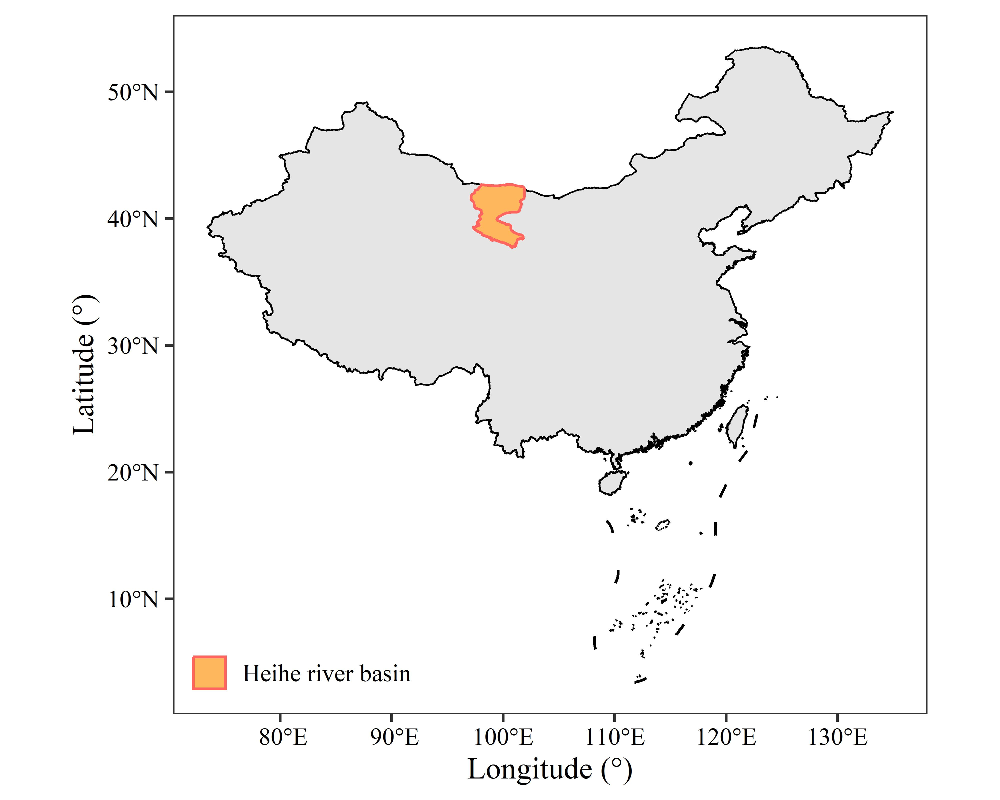
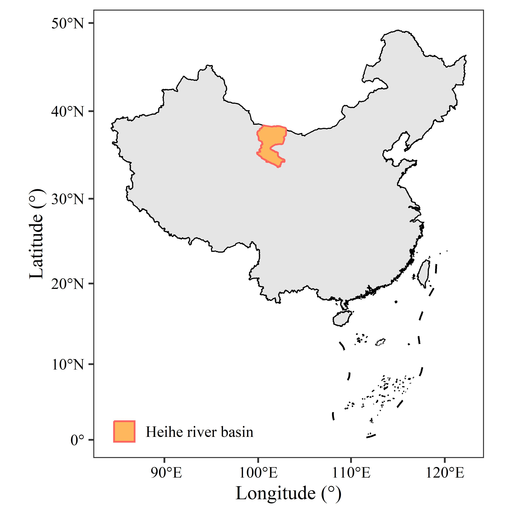
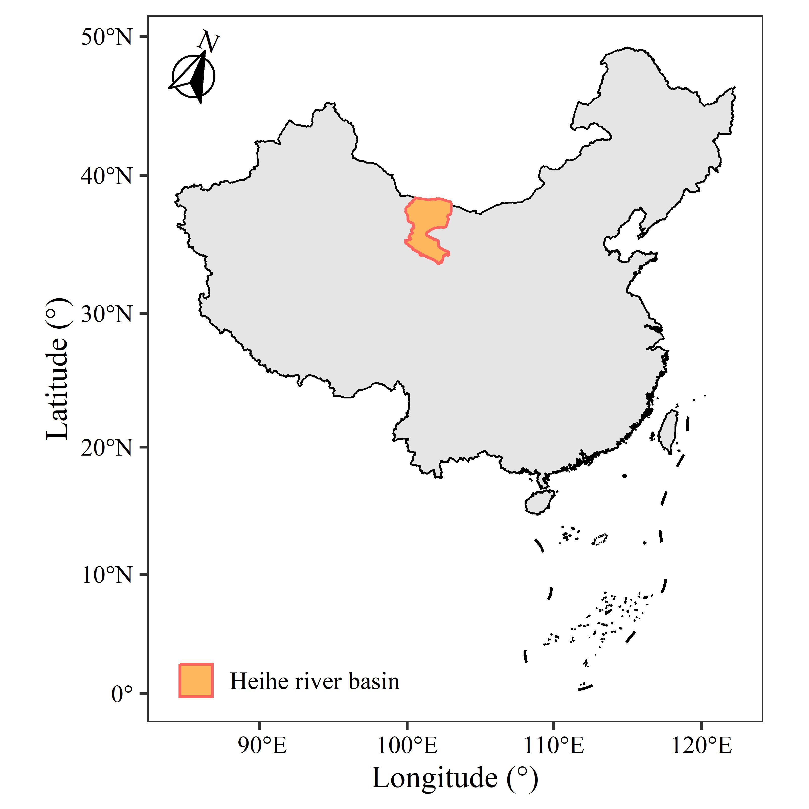
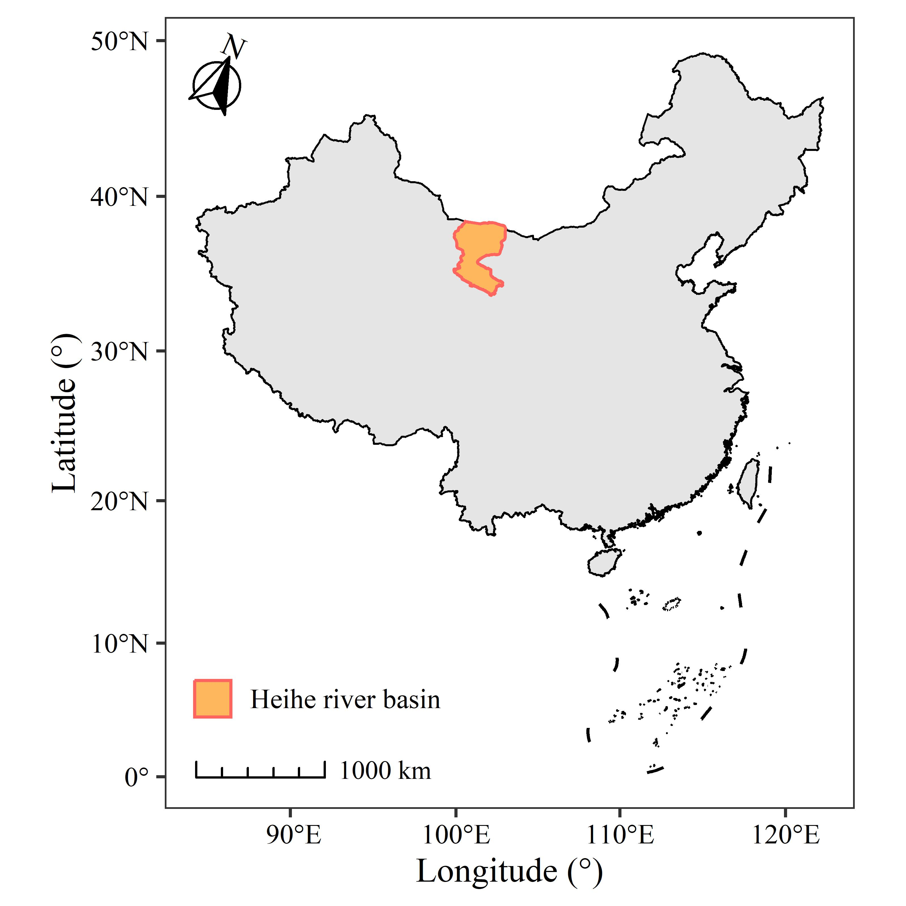
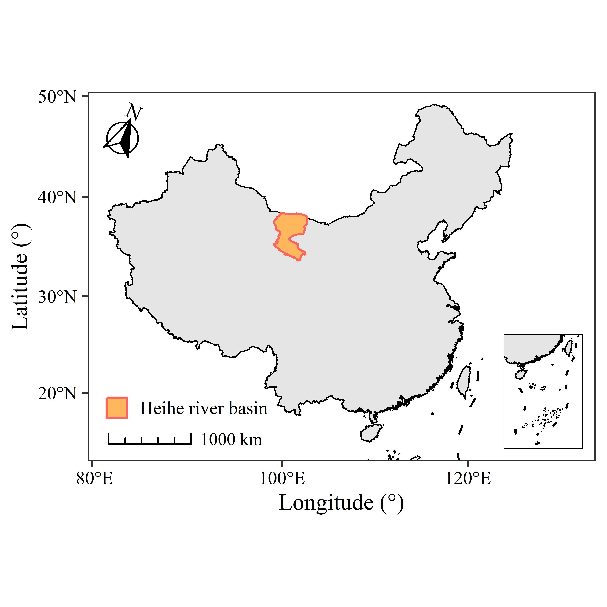

[点击下载本文全部代码](R语言空间数据综合制图_代码.R)

[点击下载本文全部数据](R语言空间数据综合制图_数据.zip)

空间数据的简单可视化通常不能直接作为论文配图，一张标准的地图还需要考虑投影、比例尺、指北针等制图要素。本文展示了一张标准地图的生产过程。可视化内容请参考前一篇post——[R语言空间数据可视化 | Xiaoran Wu](https://www.wuxiaoran.top/post/r%E8%AF%AD%E8%A8%80%E7%A9%BA%E9%97%B4%E6%95%B0%E6%8D%AE%E5%8F%AF%E8%A7%86%E5%8C%96/)。

首先加载将使用到的packages：

- sf：矢量数据处理

- ggplot2：绘图地图

- ggspatial：绘制比例尺、指北针

- cowplot：拼接主图与子图

```r
library(sf)
library(ggplot2)
library(ggspatial)
library(cowplot)
```

再加载将使用到的数据：

```r
Boundary_China <- st_read('Boundary_China.shp')
Boundary_Heihe <- st_read('Boundary_Heihe.shp')
Jiuduanxian <- st_read('Jiuduanxian.shp')
Nanhai <- st_read('Nanhai.shp')

Boundary_Heihe$name <- "Heihe river basin"
```

使用以下代码，可生成一幅仅被可视化的地图。

```r
ggplot()+
  geom_sf(data = Boundary_China,
          linewidth = 0.3,
          color = "black")+
  geom_sf(data = Boundary_Heihe,
          aes(color = name),
          fill = "#ffb75e",
          linewidth = 0.5) +
  geom_sf(data = Jiuduanxian)+
  geom_sf(data = Nanhai,
          linewidth = 0.3,
          color = "black")+
  coord_sf(crs = st_crs(4236)) +
  scale_color_manual(values = "#ff645e") +
  labs(x = "Longitude (°)",
       y = "Latitude (°)",
       color = NULL) +
  theme_bw() +
  theme(text = element_text(family = "serif"),
        axis.text = element_text(color = "black"),
        panel.grid = element_blank(),
        legend.position = c(0.17,0.07),
        legend.key.size = unit(13, "pt"))
```



# 一、投影

改变地图投影的函数是`coord_sf()`，函数中的crs参数可以使用PROJ4字符串或ESPG码。如原图中使用了ESPG码（4236）来使用WGS84投影。

Albers是我国常用的地图投影之一。中国所使用的Albers的参数是双标准纬线（25°N与47°N）中央经线为105°E，椭球体为Krassovsky。用PROJ4表示为“`+proj=aea +ellps=krass +lon_0=105 +lat_1=25 +lat_2=47`”。

使用以下代码替换原图的投影：

```r
coord_sf(crs = "+proj=aea +ellps=krass +lon_0=105 +lat_1=25 +lat_2=47")
```

生成的新图效果如下：

 

# 二、指北针

`annotation_north_arrow()`函数可以为图片添加指北针。其中主要设置的属性如下：

- location：相对位置，上左为“tl”，下右为“br”，以此类推；

- pad_x/pad_y：设置横向/纵向的偏移，以unit()函数构建；

- height/width：指北针的高度与宽度，以unit()函数构建；

- which_north：指北针的北所指的方向，“grid”为图面的北，“true”为坐标系北；

- style：指北针样式，共四个样式，可通过样式同名函数构建来自定义样式。

  在前一幅图的代码中添加以下代码增加指北针：

```r
annotation_north_arrow(location = "tl",
                       pad_x = unit(5, "pt"),
                       pad_y = unit(7, "pt"),
                       height = unit(25, "pt"),
                       width = unit(25, "pt"),
                       which_north = "true",
                       style = north_arrow_fancy_orienteering(text_family = "serif"))
```



# 三、比例尺

`annotation_scale()`函数用于创建比例尺。主要的属性设置如下：

- location：相对位置，上左为“tl”，下右为“br”，以此类推；

- pad_x/pad_y：设置横向/纵向的偏移，以unit()函数构建；

- height：比例尺的高度，以unit()函数构建；

- width_hint：比例尺的宽度，为比例尺占图面宽度的比例；

- style：比例尺样式，有“bar”与“ticks”；

- unit_category：设置比例尺的单位，“metric”公制，“imperial”英制；

- text_*：与字体相关的设置

  在前一幅图的代码中添加以下代码增加比例尺：

```r
annotation_scale(location = "bl",
                 pad_x = unit(10, "pt"),
                 pad_y = unit(10, "pt"),
                 height = unit(5, "pt"),
                 width_hint = 0.2,
                 style = "ticks",
                 unit_category = "metric",
                 text_family = "serif",
                 line_width = 1)
```



# 四、子图

当绘制中国地图时常常需要补充一个南海区域的小图，而美国地图则需要补充阿拉斯加半岛的小图，有时候则是补充一个鹰眼视图，原理是相同的。

先绘制好两个图，都需要在`coord_sf()`函数中使用xlim和ylim属性设置图面范围；再使用cowplot包中的`draw_plot()`函数逐个绘制，x与y属性设置子图左下角在主图中的位置，height和width属性分别设置子图的高度与宽度。

子图绘制的完整代码如下：

```r
main_polt <- ggplot()+
  geom_sf(data = Boundary_China,
          linewidth = 0.3,
          color = "black") +
  geom_sf(data = Boundary_Heihe,
          aes(color = name),
          fill = "#ffb75e",
          linewidth = 0.5) +
  geom_sf(data = Jiuduanxian) +
  geom_sf(data = Nanhai,
          linewidth = 0.3,
          color = "black") +
  annotation_north_arrow(location = "tl",
                         pad_x = unit(5, "pt"),
                         pad_y = unit(7, "pt"),
                         height = unit(25, "pt"),
                         width = unit(25, "pt"),
                         which_north = "true",
                         style = north_arrow_fancy_orienteering(text_family = "serif")) +
  annotation_scale(location = "bl",
                   pad_x = unit(10, "pt"),
                   pad_y = unit(8, "pt"),
                   height = unit(5, "pt"),
                   width_hint = 0.2,
                   style = "ticks",
                   unit_category = "metric",
                   text_family = "serif",
                   line_width = 1,
  ) +
  coord_sf(crs = "+proj=aea +ellps=krass +lon_0=105 +lat_1=25 +lat_2=47",
           ylim = c(1851151, 5863805), 
           xlim = c(-2601944, 2924108))+
  scale_color_manual(values = "#ff645e") +
  labs(x = "Longitude (°)",
       y = "Latitude (°)",
       color = NULL) +
  theme_bw() +
  theme(text = element_text(family = "serif"),
        axis.text = element_text(color = "black"),
        panel.grid = element_blank(),
        legend.position = c(0.197,0.16),
        legend.key.size = unit(11, "pt"),
        legend.background = element_blank())

sub_plot <- ggplot()+
  geom_sf(data = Boundary_China,
          linewidth = 0.3,
          color = "black") +
  geom_sf(data = Jiuduanxian) +
  geom_sf(data = Nanhai,
          linewidth = 0.3,
          color = "black") +
  coord_sf(crs = "+proj=aea +ellps=krass +lon_0=105 +lat_1=25 +lat_2=47",
           ylim = c(370910,2809416),
           xlim = c(200000,1870662))+
  theme_void() +
  theme(panel.border = element_rect(fill = "transparent"))

ggdraw() +
  draw_plot(main_polt) +
  draw_plot(sub_plot, x = 0.83, y = 0.16, width = 0.13, height = 0.39)
```

子图的绘制效果，也即本文考虑全部制图要素后绘制的标准地图如下：


