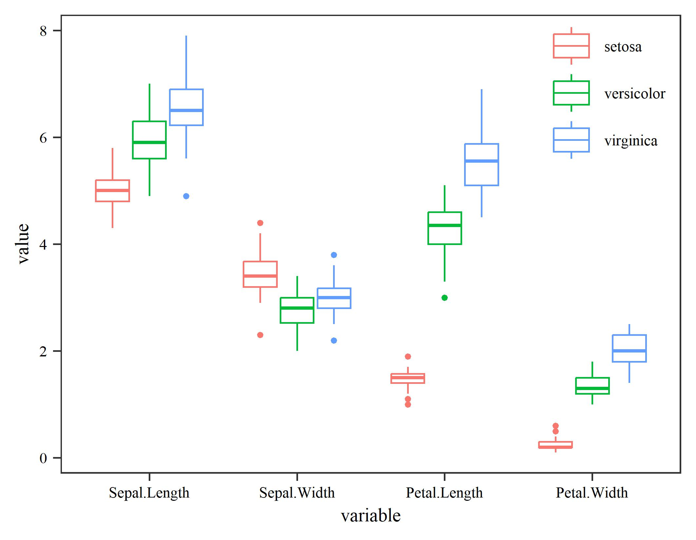
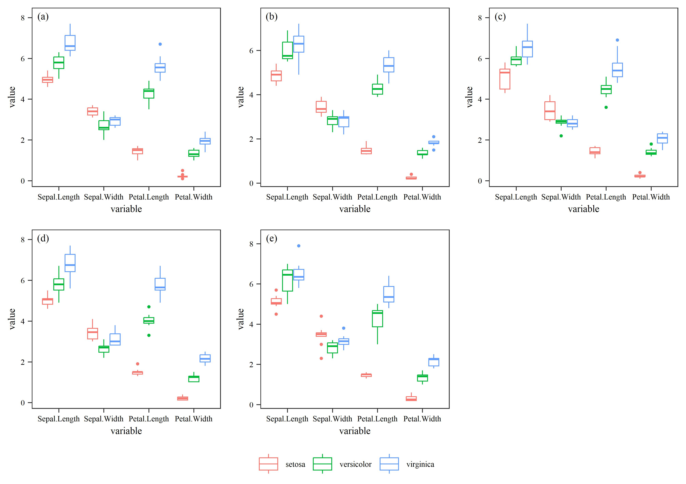

[点击下载本文全部代码](R语言箱型图绘制模板_代码.R)

在熟悉绘图函数及其参数设置后，形成一套通用模板有助于提高制图效率。本文展示了几种基于R语言ggplot2包的箱型图绘制代码。

--- 

# 一、单一箱型图

```r
## library
library(reshape2)
library(ggplot2)

## read data
data <- iris
data$Index <- 1:nrow(data)
data_long <- melt(data = data, 
                  id.vars = c("Species","Index"))

## plot
ggplot(data = data_long,
       mapping = aes(x = variable,
                     y = value,
                     color = Species))+
  geom_boxplot(outlier.size = 0.5,
               linewidth = 0.3)+
  theme_bw()+
  theme(text = element_text(family = "serif",
                            size = 7),
        panel.grid.major = element_blank(),
        panel.grid.minor = element_blank(),
        legend.position = c(0.88,0.84),
        legend.title = element_blank(),
        legend.background = element_blank(),
        axis.text = element_text(color = "black"),
        axis.ticks = element_line(linewidth = 0.3))

## save
ggsave("fig1.jpg",
       width = 9,
       height = 7,
       units = "cm",
       dpi = 600)
```



# 二、多箱型图

```r
## library
library(reshape2)
library(ggplot2)
library(ggpubr)

## read data
data <- iris
data$Index <- 1:nrow(data)
data$Sample <- rep(rep(1:5,10)[sample(50,50)],3)
data_long <- melt(data = data, 
                  id.vars = c("Species","Index","Sample"))


## plotfun
plotfun <- function(data, label){
  ggplot(data = data,
         mapping = aes(x = variable,
                       y = value,
                       color = Species))+
    geom_boxplot(outlier.size = 0.5,
                 linewidth = 0.3)+
    annotate("text",
             x = 0.65,
             y = max(data$value)*1.05,
             label = label,
             family="serif", size = 2.5) +
    theme_bw()+
    theme(text = element_text(family = "serif",
                              size = 7),
          panel.grid.major = element_blank(),
          panel.grid.minor = element_blank(),
          legend.position = c(0.88,0.84),
          legend.title = element_blank(),
          legend.background = element_blank(),
          axis.text = element_text(color = "black"),
          axis.ticks = element_line(linewidth = 0.3))
}

## plot
a <- plotfun(data_long[data_long$Sample==1,], "(a)")
b <- plotfun(data_long[data_long$Sample==2,], "(b)")
c <- plotfun(data_long[data_long$Sample==3,], "(c)")
d <- plotfun(data_long[data_long$Sample==4,], "(d)")
e <- plotfun(data_long[data_long$Sample==5,], "(e)")

ggarrange(a,b,c,d,e,
          ncol = 3,
          nrow = 2,
          align = "hv",
          common.legend = T,
          legend = "bottom")

## save
ggsave("fig2.jpg",
       width = 17,
       height = 12,
       units = "cm",
       dpi = 600)
```


