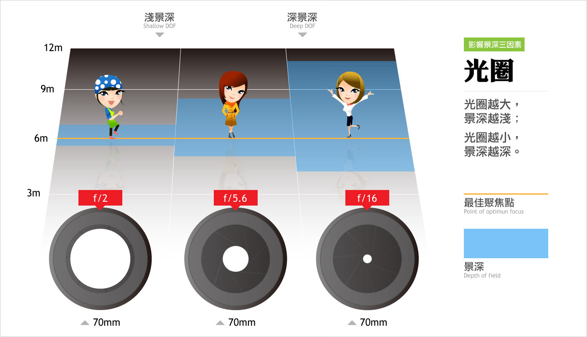
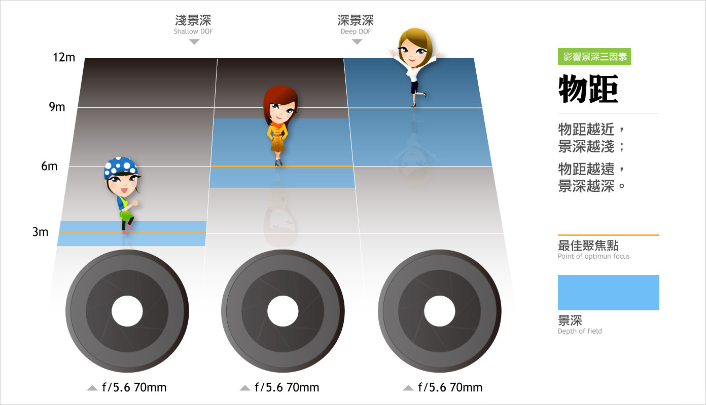
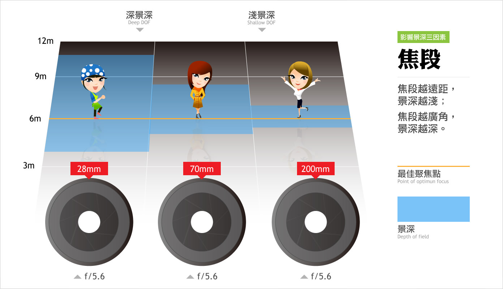
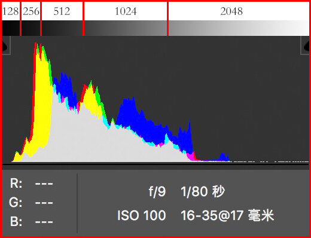
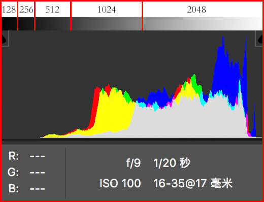
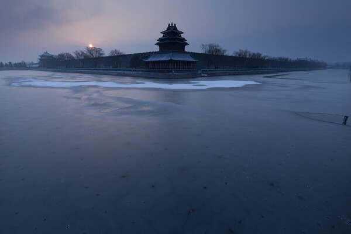
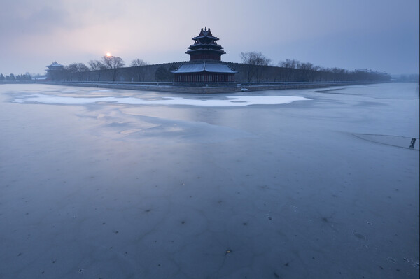
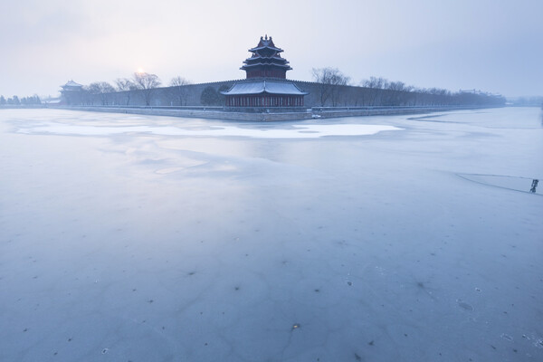
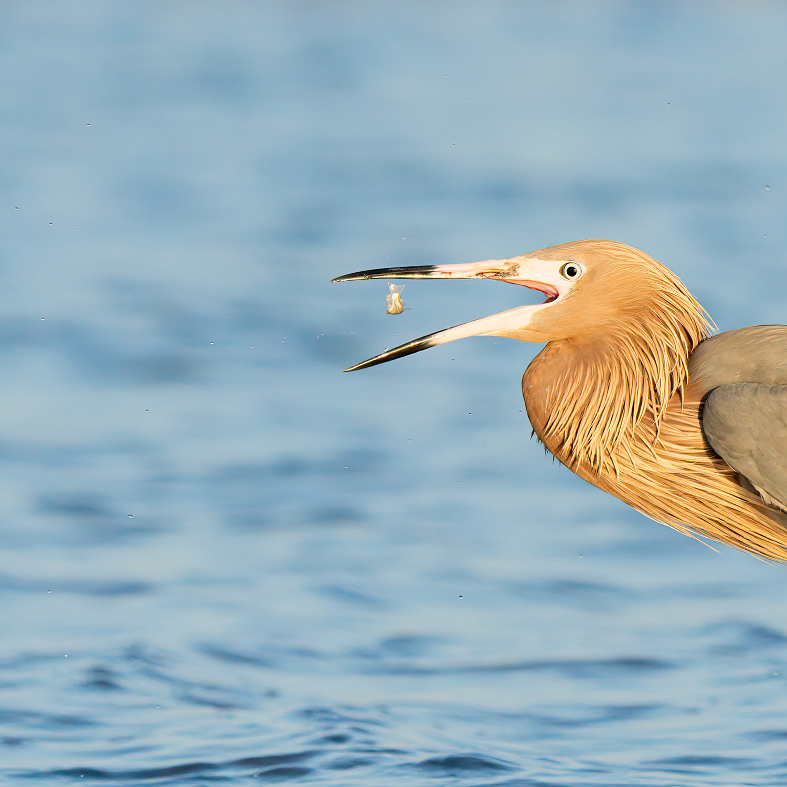

**笔记说明**：这份笔记是我学习视觉中国签约摄影师 **[熊熊Bearie](https://space.bilibili.com/96625571)** 的B站百万播放摄影教程——**[《从零开始手把手教你学摄影》](https://www.bilibili.com/video/BV1pv411H78e?p=1)**（视频总长8小时）总结的关键知识要点，**非教程向**。

**课程评价** ：

* 视频画面质量：★★★★★ 画面清晰度高，录制背景选择也不错；
* 视频音质质量：★★★★★ 音质清晰干净，无环境杂音；
* 发音是否标准：★★★★★ 标准的普通话发音，无方言口音；
* 咬字是否清晰：★★★★★ 吐字清晰不拖沓，理解速度快的可以1.5倍速观看;
* 知识是否体系：★★★★★ 视频开头会介绍总体框架，末尾会总结思维导图，教程的整体安排也符合初学者学习逻辑；
* 讲解是否透彻：★★★★☆ 多数知识点讲解清晰，易于理解，部分知识点需要一定基础或课外查阅和补充相关内容。

- - -

## 知识点

1. 曝光三要素：

1. 光圈：光圈越**大**，照片越**亮**，虚化效果越**好**；

2. 快门：快门越**快**，照片越**暗**，抓拍效果越**好**；

3. 感光度：感光度越**低**，照片越**暗**，噪点越**少**。

4. 影响景深的要素：

   1. 光圈：光圈越**大**，景深越**小**；
      
   2. 对焦距离：对焦距离越**近**，景深越**小**；
      
   3. 焦段：焦距越**长**，景深越**小**。
      
5. 拍摄时如果需要后期， RAW格式比JPG格式的细节更多。
   !
6. 进光量充足时，感光度越小画质越好；进光量不足导致暗部超出宽容度下限时，提高感光度，后期降低曝光，画质更好。
7. 拍摄时的最佳曝光：根据直方图判断，适当增加曝光，使画面的高光部分尽可能抵到相机宽容度上限但不过曝，从而获得更多暗部细节。

|  |  |  |
| ---------------------- | --------------------------- | ---------------------- |
|    |    |    |

6. 大光比拍摄要点：

   1. 同一取景分别拍摄保留明暗细节的照片，后期HDR合成。
   2. 向左曝光，宁欠勿过。
7. 降噪技巧：

   1. 连拍多张，后期进行平均堆栈；
   2. 提高曝光，保留暗部细节，后期降低曝光；
   3. 利用降噪插件进行降噪，如[DeNoise AI](https://www.topazlabs.com/denoise-ai)插件。

|  |  |
| --- | --- |

8. 要获得夜景中灯光呈星芒的效果，要用小光圈。
9. 连拍堆栈可以获得与长曝光类似的流云、拉丝水流、车轨等效果。
10. 对焦合成可以获得多点对焦的照片。